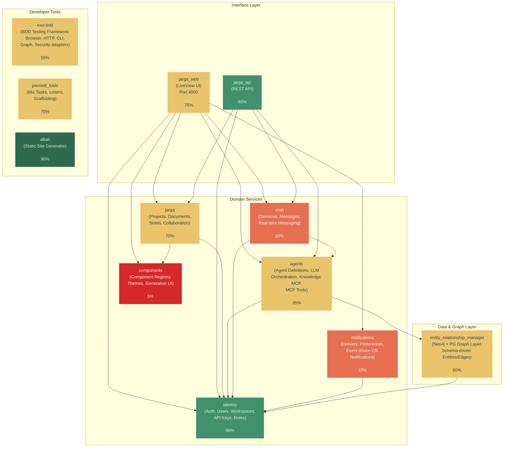

# Perme8 Architecture Graph

> Envisioned architecture with current completion status, per-app feature inspection, and alignment to platform principles.

## Platform Principles

Every architectural decision in Perme8 serves four end-goals:

| Principle | Description |
|---|---|
| **Modularity** | Each bounded context is an independently deployable umbrella app with its own domain, application, and infrastructure layers. Services communicate via defined behaviours and facades, never by reaching into another app's internals. |
| **Interoperability** | Services expose clean APIs (REST, PubSub, behaviours) that allow any consumer -- internal app, external system, or LLM agent -- to interact without coupling. The MCP tool endpoint and bot network extend this to machine-to-machine communication. |
| **Multitenancy** | Workspace-scoped isolation is a first-class citizen. Identity owns the tenancy boundary. Every domain service receives workspace context and enforces scoping at the query, policy, and API layers. No data leaks between tenants. |
| **Event-Driven Design** | Services communicate through a shared PubSub event bus. State changes emit domain events. Consumers subscribe and react. This decouples producers from consumers and enables future extraction to standalone services. |

---

## System Overview

### Colour Legend

| Colour | Completion |
|--------|-----------|
| Dark Green | 80-100% |
| Green | 60-79% |
| Yellow | 40-59% |
| Orange | 15-39% |
| Red | 0-14% |

---

## Feature Inspection by App

Each section below lists every BDD feature and its scenarios for the given app. These are derived directly from the `.feature` files in the codebase. Step definitions are excluded -- this is a capability map, not a test implementation reference.

---

### identity -- 90%

**Principles served:** Multitenancy (owns the tenancy boundary), Modularity (standalone app, no umbrella deps)

**Envisioned capabilities:** User registration and auth, magic link and password login, session management, workspace CRUD, membership and role management, API key management, workspace invitations, workspace UI for managing invites/roles.

**Remaining:** Workspace management UI (specced).

**2 feature files, 58 scenarios**

<strong>Identity Browser UI</strong> -- 18 scenarios

> As a user, I want to use the Identity authentication pages in a browser so that I can register, log in, reset my password, and manage API keys.

| # | Scenario |
|---|---------|
| 1 | Login page displays correctly |
| 2 | User requests magic link via UI |
| 3 | User sees error for wrong password |
| 4 | Registration page displays correctly |
| 5 | User registers successfully via UI |
| 6 | Registration shows validation errors for short password |
| 7 | Registration shows validation errors for invalid email |
| 8 | User navigates from login to registration |
| 9 | User navigates from registration to login |
| 10 | Forgot password page displays correctly |
| 11 | User requests password reset with valid email |
| 12 | User requests password reset with unknown email |
| 13 | Reset password page displays correctly with valid token |
| 14 | User tries to reset password with invalid token |
| 15 | User tries to reset password with mismatched confirmation |
| 16 | User tries to reset password with short password |
| 17 | User navigates from forgot password to login |
| 18 | User navigates from login to forgot password |

<strong>Identity Application Security Baseline</strong> -- 40 scenarios

> As a security engineer, I want to verify the Identity authentication endpoints are free from common vulnerabilities so that user credentials, sessions, password reset tokens, and API keys are protected against attack.

| # | Scenario |
|---|---------|
| 1 | Spider discovers login page attack surface |
| 2 | Spider discovers registration page attack surface |
| 3 | Spider discovers password reset page attack surface |
| 4 | Passive scan on login page finds no high-risk issues |
| 5 | Passive scan on registration page finds no high-risk issues |
| 6 | Passive scan on password reset page finds no high-risk issues |
| 7 | Passive scan on reset password token page finds no high-risk issues |
| 8 | Passive scan on settings page finds no high-risk issues |
| 9 | Passive scan on API keys page finds no high-risk issues |
| 10 | No SQL Injection on login page |
| 11 | No SQL Injection on registration page |
| 12 | No SQL Injection on password reset page |
| 13 | No SQL Injection on reset password token page |
| 14 | No Cross-Site Scripting on login page |
| 15 | No Cross-Site Scripting on registration page |
| 16 | No Cross-Site Scripting on password reset page |
| 17 | No Cross-Site Scripting on reset password token page |
| 18 | No path traversal on reset password token page |
| 19 | No path traversal on settings page |
| 20 | No path traversal on API keys page |
| 21 | No remote code execution on login page |
| 22 | No remote code execution on registration page |
| 23 | No remote code execution on password reset page |
| 24 | No CSRF vulnerabilities on login page |
| 25 | No CSRF vulnerabilities on registration page |
| 26 | No CSRF vulnerabilities on password reset page |
| 27 | Comprehensive active scan on authentication pages finds no high-risk vulnerabilities |
| 28 | Comprehensive active scan on protected pages finds no high-risk vulnerabilities |
| 29 | Baseline scan on login page passes |
| 30 | Baseline scan on registration page passes |
| 31 | Baseline scan on password reset page passes |
| 32 | Baseline scan on reset password token page passes |
| 33 | Baseline scan on settings page passes |
| 34 | Baseline scan on API keys page passes |
| 35 | Login page returns proper security headers |
| 36 | Registration page returns proper security headers |
| 37 | Password reset page returns proper security headers |
| 38 | Settings page returns proper security headers |
| 39 | API keys page returns proper security headers |
| 40 | Generate security audit report for Identity application |

---

### jarga (core) -- 70%

**Principles served:** Modularity (projects, documents, notes as a focused content service), Multitenancy (workspace-scoped queries and policies), Event-Driven (PubSub notifications on content changes)

**Envisioned capabilities:** Projects CRUD, documents CRUD with visibility/access policies, notes with Yjs real-time collaboration, slug generation, event-driven architecture, delegation facade removal.

**Remaining:** Event-driven migration, remove `Jarga.Accounts`/`Jarga.Workspaces` delegation facades, extract agents/chat/notifications/components into standalone apps.

> Note: jarga currently hosts bounded contexts for agents, chat, notifications, and components that are targeted for extraction. Features for those contexts are listed under their future app headings.

---

### jarga_web -- 75%

**Principles served:** Interoperability (interface layer calling all domain facades), Multitenancy (workspace-scoped routing and UI)

**Envisioned capabilities:** Full LiveView UI for workspaces, projects, documents, agents, chat, notifications. Post-extraction: facades to all extracted domain services, component system UI.

**Remaining:** Extraction facades for agents/chat/notifications/components, component system UI, chat bubble redesign.

**22 feature files, 244 scenarios**

#### Workspaces

<strong>Workspace CRUD Operations</strong> -- 7 scenarios

> As a workspace user, I want to create, edit, and delete workspaces so that I can organize my team's work.

| # | Scenario |
|---|---------|
| 1 | Owner creates a new workspace |
| 2 | Admin edits workspace details |
| 3 | Member cannot edit workspace |
| 4 | Guest cannot edit workspace |
| 5 | Owner deletes workspace |
| 6 | Admin cannot delete workspace |
| 7 | Invalid workspace creation shows errors |

<strong>Workspace Member Management</strong> -- 8 scenarios

> As a workspace admin, I want to invite and manage workspace members so that I can control who has access to the workspace.

| # | Scenario |
|---|---------|
| 1 | Admin invites new member (non-Jarga user) |
| 2 | Admin adds existing Jarga user as member |
| 3 | Member cannot invite other members |
| 4 | Admin changes member role |
| 5 | Admin cannot change owner's role |
| 6 | Admin removes member |
| 7 | Admin cannot remove owner |
| 8 | Non-member cannot access workspace |

<strong>Workspace Navigation</strong> -- 6 scenarios

> As a workspace user, I want to navigate between workspaces and view workspace content so that I can easily access my team's work.

| # | Scenario |
|---|---------|
| 1 | Member views workspace details |
| 2 | Guest can view workspace but limited actions |
| 3 | Member can create projects and documents |
| 4 | Workspace list shows all user workspaces |
| 5 | Empty workspace list shows helpful message |
| 6 | Workspace with color displays correctly |

#### Projects

<strong>Project Access Control</strong> -- 8 scenarios

> As a workspace member, I want project permissions to be enforced so that only authorized users can manage projects.

| # | Scenario |
|---|---------|
| 1 | List all projects in workspace |
| 2 | Guest can view projects in workspace |
| 3 | Non-member cannot list projects |
| 4 | Projects are scoped to workspace |
| 5 | Owner has full access to all projects in workspace |
| 6 | Admin has full access to all projects in workspace |
| 7 | Member has limited access to projects |
| 8 | Guest has read-only access to projects |

<strong>Project CRUD Operations</strong> -- 23 scenarios

> As a workspace member, I want to create, update, and delete projects so that I can organize documents within my workspace.

| # | Scenario |
|---|---------|
| 1 | Owner creates a project in workspace |
| 2 | Admin creates a project in workspace |
| 3 | Member creates a project in workspace |
| 4 | Guest cannot create projects |
| 5 | Non-member cannot create projects |
| 6 | Create project with full details |
| 7 | Project slug is unique within workspace |
| 8 | Project slug is generated from name |
| 9 | Create project with empty or missing name |
| 10 | Project slug handles special characters |
| 11 | Owner updates their own project name |
| 12 | Owner updates project description |
| 13 | Owner updates project color |
| 14 | Admin can update any project |
| 15 | Member can only update their own projects |
| 16 | Guest cannot update any projects |
| 17 | Update project with empty name |
| 18 | Owner deletes their own project |
| 19 | Admin can delete any project |
| 20 | Member can only delete their own projects |
| 21 | Guest cannot delete any projects |
| 22 | Non-member cannot delete projects |
| 23 | Deleting project does not delete documents |

<strong>Project Integration</strong> -- 6 scenarios

> As a workspace member, I want projects to integrate with workspaces and documents so that I have a cohesive organization experience.

| # | Scenario |
|---|---------|
| 1 | Project creation notification to workspace members |
| 2 | Project update notification to workspace members |
| 3 | Project deletion notification to workspace members |
| 4 | Workspace name updates in project view |
| 5 | Breadcrumb navigation in project view |
| 6 | Project contains associated documents |

#### Documents

<strong>Document Access Control</strong> -- 10 scenarios

> As a workspace member, I want document visibility and permissions to be enforced so that private documents remain confidential.

| # | Scenario |
|---|---------|
| 1 | Owner views their own private document |
| 2 | Member cannot view another user's private document |
| 3 | Admin cannot view another user's private document |
| 4 | Member views public document created by another user |
| 5 | Guest views public document in read-only mode |
| 6 | Guest cannot view private documents |
| 7 | Non-member cannot view any documents |
| 8 | Breadcrumb navigation in document view |
| 9 | Workspace name updates in document view |
| 10 | Project name updates in document view |

<strong>Document Collaboration</strong> -- 6 scenarios

> As a workspace member, I want to collaborate on documents in real-time so that my team can work together efficiently.

| # | Scenario |
|---|---------|
| 1 | Multiple users edit document simultaneously |
| 2 | User saves document content |
| 3 | User force saves on tab close |
| 4 | Document title change notification |
| 5 | Document visibility change notification |
| 6 | Document pin status change notification |

<strong>Document Components</strong> -- 3 scenarios

> As a workspace member, I want documents to have embedded components so that I can structure content within documents.

| # | Scenario |
|---|---------|
| 1 | Document has embedded note component by default |
| 2 | Access document's embedded note |
| 3 | Document inherits project from note |

<strong>Document CRUD Operations</strong> -- 30 scenarios

> As a workspace member, I want to create, update, and delete documents so that I can manage my team's documentation.

| # | Scenario |
|---|---------|
| 1 | Owner creates a document in workspace |
| 2 | Admin creates a document in workspace |
| 3 | Member creates a document in workspace |
| 4 | Guest cannot create documents |
| 5 | Non-member cannot create documents |
| 6 | Create document with project association |
| 7 | Cannot create document with project from different workspace |
| 8 | Document slug is unique within workspace |
| 9 | Create document without title |
| 10 | Document slug handles special characters |
| 11 | Owner updates their own document title |
| 12 | Owner changes document visibility to public |
| 13 | Owner changes document visibility to private |
| 14 | Member edits public document they don't own |
| 15 | Member cannot edit private document they don't own |
| 16 | Admin can edit public documents |
| 17 | Admin cannot edit private documents they don't own |
| 18 | Guest cannot edit any documents |
| 19 | Update document with empty title |
| 20 | Owner pins their own document |
| 21 | Owner unpins their own document |
| 22 | Member pins public document |
| 23 | Member cannot pin private document they don't own |
| 24 | Guest cannot pin any documents |
| 25 | Owner deletes their own document |
| 26 | Admin deletes public document |
| 27 | Admin cannot delete private documents they don't own |
| 28 | Member cannot delete documents they don't own |
| 29 | Guest cannot delete any documents |
| 30 | Transaction rollback on note creation failure |

<strong>Todo Checkbox Strikethrough</strong> -- 2 scenarios

> As a user, I want checked todo items to appear with strikethrough text so that I can visually distinguish completed items from pending ones.

| # | Scenario |
|---|---------|
| 1 | Checking a todo item applies strikethrough |
| 2 | Unchecking a todo item removes strikethrough |

<strong>Document Listing</strong> -- 3 scenarios

> As a workspace member, I want to see documents filtered by visibility and project so that I can find the documents I need.

| # | Scenario |
|---|---------|
| 1 | User sees their own documents and public documents |
| 2 | Workspace page shows only workspace-level documents (not project documents) |
| 3 | List documents filtered by project |

#### Chat

<strong>Chat Agent Selection</strong> -- 11 scenarios

> As a user, I want to select which AI agent to chat with so that I can use the right assistant for my task.

| # | Scenario |
|---|---------|
| 1 | Agent selector shows available agents |
| 2 | Select an agent for chatting |
| 3 | Agent selector excludes disabled agents |
| 4 | Auto-select first agent when none previously selected |
| 5 | Restore previously selected agent |
| 6 | Agent selection saved to preferences |
| 7 | Agent selection is workspace-scoped |
| 8 | Different agent selection per workspace |
| 9 | Handle workspace with no enabled agents |
| 10 | Handle deleted agent gracefully |
| 11 | Agent selector has accessible label |

<strong>Chat Context Integration</strong> -- 7 scenarios

> As a user, I want the chat to use relevant context from my documents so that the AI agent can give me more relevant and accurate responses.

| # | Scenario |
|---|---------|
| 1 | Chat uses document context when viewing a document |
| 2 | Agent system prompt combined with document context |
| 3 | Agent configuration affects LLM call |
| 4 | Chat without document context uses only agent prompt |
| 5 | Context switches when changing documents |
| 6 | Session scoped to project when available |
| 7 | Agent without system prompt works correctly |

<strong>Chat Editor Integration</strong> -- 6 active scenarios (+9 planned)

> As a user, I want to invoke AI agents directly from the document editor so that I can get AI assistance without leaving my editing context.

| # | Scenario |
|---|---------|
| 1 | Execute agent query with @j command |
| 2 | Agent query uses document content as context |
| 3 | Valid agent invocation with mocked response |
| 4 | Insert button only visible on document pages |
| 5 | Completed agent response becomes regular text |
| 6 | Insert markdown content preserves formatting |

<strong>Chat Messaging</strong> -- 20 scenarios

> As a user, I want to send messages to AI agents and receive responses so that I can get help with my work.

| # | Scenario |
|---|---------|
| 1 | Send a message and see it in chat |
| 2 | Message is saved to database |
| 3 | Receive agent response |
| 4 | Send message with Enter key |
| 5 | Cannot send empty message |
| 6 | View message history in chat |
| 7 | Messages display timestamps |
| 8 | Shift+Enter creates new line without sending |
| 9 | Delete a message |
| 10 | Delete button only appears for saved messages |
| 11 | Cannot delete message from non-existent session |
| 12 | Delete message shows confirmation dialog |
| 13 | Message delete button has accessible styling |
| 14 | Code blocks displayed with syntax highlighting |
| 15 | Markdown headings rendered as HTML |
| 16 | Bold and italic text rendered correctly |
| 17 | Ordered and unordered lists rendered |
| 18 | Links rendered as clickable |
| 19 | Blockquotes rendered with styling |
| 20 | Complex markdown renders all elements |

<strong>Chat Panel Core</strong> -- 12 scenarios

> As a user, I want to open and close the global chat panel so that I can access AI assistance when needed without cluttering my workspace.

| # | Scenario |
|---|---------|
| 1 | Chat panel is present in admin layout |
| 2 | Open chat panel displays chat interface |
| 3 | Toggle chat panel open and closed |
| 4 | Chat panel state persists to localStorage |
| 5 | Chat panel is accessible on desktop by default |
| 6 | Chat panel available on all admin pages |
| 7 | Chat panel maintains state across page navigation |
| 8 | Escape key closes chat panel |
| 9 | Chat panel preference preserved during viewport resize |
| 10 | Clear button disabled when chat is empty |
| 11 | New conversation button disabled when chat is empty |
| 12 | Chat panel slides from right with animation |

<strong>Chat Session Management</strong> -- 17 scenarios

> As a user, I want to manage my chat conversation history so that I can continue previous conversations and organize my AI interactions.

| # | Scenario |
|---|---------|
| 1 | Create new chat session on first message |
| 2 | Messages added to existing session |
| 3 | Start new conversation clears chat |
| 4 | View conversation history |
| 5 | Load conversation from history |
| 6 | Restore most recent session on mount |
| 7 | Delete conversation from history |
| 8 | Deleting active conversation clears chat view |
| 9 | Deleting inactive conversation preserves active chat |
| 10 | Session title generated from first message |
| 11 | Restore session from localStorage |
| 12 | Clear invalid session from localStorage |
| 13 | Empty conversations list shows helpful message |
| 14 | Conversation history limited to 20 sessions |
| 15 | Delete confirmation dialog for conversations |
| 16 | Delete icon styling on conversation list |
| 17 | Preserve chat across LiveView reconnections |

<strong>Chat Streaming Responses</strong> -- 17 scenarios

> As a user, I want to see agent responses stream in real-time so that I get immediate feedback and can see the agent thinking process.

| # | Scenario |
|---|---------|
| 1 | Receive streaming response from agent |
| 2 | Streaming response saved to database on completion |
| 3 | Handle streaming error gracefully |
| 4 | Cancel streaming response |
| 5 | Streaming chunks update display in real-time |
| 6 | Stream buffer cleared on completion |
| 7 | Display loading indicator while waiting for response |
| 8 | Document source attribution displayed with response |
| 9 | Cancelled response shows cancelled indicator |
| 10 | Handle streaming error mid-response |
| 11 | Loading indicator has appropriate styling |
| 12 | Preserve chat across LiveView reconnections |
| 13 | Chat panel updates when new agent added to workspace |
| 14 | Chat panel updates when agent is deleted |
| 15 | Agent update propagates to chat panel |
| 16 | Agent selection broadcasts to parent LiveView |
| 17 | Agent deletion with auto-select fallback |

#### Agents

<strong>Agent CRUD Operations</strong> -- 24 scenarios

> As a user, I want to create, update, and delete AI agents so that I can customize my AI assistant experiences.

| # | Scenario |
|---|---------|
| 1 | Create a new personal agent with default settings |
| 2 | Create an agent with custom configuration |
| 3 | Create agent with invalid temperature |
| 4 | Create agent without required name |
| 5 | Configure token costs for agent |
| 6 | Duplicate agent names are allowed |
| 7 | Agent with empty model uses system default |
| 8 | Agent temperature outside range is rejected |
| 9 | Update agent configuration |
| 10 | Update agent visibility from PRIVATE to SHARED |
| 11 | Cannot update another user's agent |
| 12 | Delete an agent |
| 13 | Cannot delete another user's agent |
| 14 | Clone my own agent |
| 15 | Cannot clone private agent that's not mine |
| 16 | View my personal agents list |
| 17 | Empty agents list shows prompt to create first agent |
| 18 | Only owner can edit agent |
| 19 | Only owner can delete agent |
| 20 | Handle agent not found gracefully |
| 21 | Validate agent parameters before saving |
| 22 | Validation rejects invalid temperature |
| 23 | Validation rejects temperature out of range |
| 24 | Validation handles missing required fields |

<strong>Agent Discovery</strong> -- 10 scenarios

> As a user, I want to find and filter available agents so that I can use the right AI assistant for my task.

| # | Scenario |
|---|---------|
| 1 | View available agents in workspace context |
| 2 | Workspace members can only see enabled agents |
| 3 | Filter agents by workspace membership |
| 4 | Agent visibility controls discoverability |
| 5 | Shared agents are discoverable in workspaces |
| 6 | Disabled agent is hidden from workspace members |
| 7 | List viewable agents shows own agents and all shared agents |
| 8 | Viewable agents ordered by most recent first |
| 9 | Agent system prompt is used in chat |
| 10 | Agent system prompt combines with document context |

<strong>Agent Real-time Updates</strong> -- 5 scenarios

> As a user, I want agent changes to propagate in real-time so that my team always sees the latest agent configuration.

| # | Scenario |
|---|---------|
| 1 | Agent updates propagate to all connected clients |
| 2 | Agent deletion removes it from connected clients |
| 3 | Agent update broadcasts to affected workspaces only |
| 4 | Agent removal broadcasts to affected workspace |
| 5 | Agent addition broadcasts to affected workspace |

<strong>Agent Workspace Assignment</strong> -- 15 scenarios

> As a user, I want to add and remove agents from workspaces so that I can share AI assistants with my team.

| # | Scenario |
|---|---------|
| 1 | Add my private agent to a workspace I belong to |
| 2 | Add my shared agent to a workspace |
| 3 | Cannot add agent to workspace I'm not a member of |
| 4 | Cannot add another user's agent to a workspace |
| 5 | Remove agent from workspace |
| 6 | Delete agent removes it from all workspaces |
| 7 | Update agent and notify affected workspaces |
| 8 | Sync agent workspaces adds to new workspaces |
| 9 | Sync agent workspaces removes from old workspaces |
| 10 | Sync agent workspaces with no changes is idempotent |
| 11 | Select agent for workspace persists in user preferences |
| 12 | Different agent selection per workspace |
| 13 | Auto-select first agent when no preference exists |
| 14 | Clone a shared agent from workspace context |
| 15 | Cannot clone agent without workspace context if not owner |

---

### jarga_api -- 80%

**Principles served:** Interoperability (RESTful API for external systems and agents), Multitenancy (API key scoped to workspaces, workspace isolation enforced), Modularity (thin controller layer delegating to domain facades)

**Envisioned capabilities:** Document API, project API, workspace API, API key authentication, event-driven integration, agents API routing.

**Remaining:** Event-driven architecture, agents API routing after extraction.

**6 feature files, 100 scenarios**

<strong>Document API Access</strong> -- 28 scenarios

> As an API consumer, I want to create and retrieve documents via the REST API using API keys so that I can integrate document management with external systems programmatically.

| # | Scenario |
|---|---------|
| 1 | User creates document via API key defaults to private visibility |
| 2 | API key without workspace access cannot create document |
| 3 | Create document with invalid data |
| 4 | Create document with explicit public visibility |
| 5 | Create document with explicit private visibility |
| 6 | Owner role API key can create documents |
| 7 | Member role API key can create documents |
| 8 | Guest role API key cannot create document |
| 9 | User creates document inside a project via API key defaults to private |
| 10 | User creates public document inside a project |
| 11 | Cannot create document in non-existent project |
| 12 | User retrieves document via API key |
| 13 | API key cannot access document in workspace it doesn't have access to |
| 14 | User retrieves document they have permission to view |
| 15 | User retrieves document from a project |
| 16 | API key respects user permissions for private documents |
| 17 | Document not found returns 404 |
| 18 | Revoked API key cannot retrieve document |
| 19 | Invalid API key cannot retrieve document |
| 20 | GET document response includes content_hash |
| 21 | Update a document title via API |
| 22 | Update document visibility via API |
| 23 | Update document content via API with correct content_hash |
| 24 | Update document title and content together via API |
| 25 | Update document content with stale content_hash returns conflict with current state |
| 26 | Update document content without content_hash returns 422 |
| 27 | Cannot update another user's private document via API |
| 28 | Update non-existent document returns 404 |

<strong>Document API Security Baseline</strong> -- 29 scenarios

> As a security engineer, I want to verify the Document API endpoints are free from common vulnerabilities so that document data, API keys, and workspace isolation are protected against attack.

| # | Scenario |
|---|---------|
| 1 | Spider discovers document API attack surface |
| 2 | Spider discovers project-scoped document endpoints |
| 3 | Passive scan on document creation endpoint finds no high-risk issues |
| 4 | Passive scan on project document creation endpoint finds no high-risk issues |
| 5 | Passive scan on document retrieval endpoint finds no high-risk issues |
| 6 | No SQL Injection on document creation endpoint |
| 7 | No SQL Injection on document retrieval endpoint |
| 8 | No SQL Injection on project document endpoint |
| 9 | No Cross-Site Scripting on document creation endpoint |
| 10 | No Cross-Site Scripting on document retrieval endpoint |
| 11 | No path traversal on document retrieval endpoint |
| 12 | No remote code execution on document creation endpoint |
| 13 | No authorization bypass on cross-workspace document access |
| 14 | Comprehensive active scan on document API finds no high-risk vulnerabilities |
| 15 | Baseline scan on document create endpoint passes |
| 16 | Baseline scan on document retrieval endpoint passes |
| 17 | Baseline scan on project document endpoint passes |
| 18 | Document retrieval endpoint returns proper security headers |
| 19 | Workspace endpoint returns proper security headers |
| 20 | Generate security audit report for document API |
| 21 | Spider discovers document update API attack surface |
| 22 | Passive scan on document update endpoint finds no high-risk issues |
| 23 | No SQL Injection on document update endpoint |
| 24 | No Cross-Site Scripting on document update endpoint |
| 25 | No path traversal on document update endpoint |
| 26 | No remote code execution on document update endpoint |
| 27 | Baseline scan on document update endpoint passes |
| 28 | Comprehensive active scan on document update endpoint finds no high-risk vulnerabilities |
| 29 | Generate security audit report for document update API |

<strong>Project API Access</strong> -- 16 scenarios

> As an API consumer, I want to create and retrieve projects via the REST API using API keys so that I can integrate project management with external systems programmatically.

| # | Scenario |
|---|---------|
| 1 | User creates project via API key |
| 2 | User creates project with minimal data |
| 3 | Create project with invalid data |
| 4 | API key without workspace access cannot create project |
| 5 | Guest role API key cannot create project |
| 6 | Owner role API key can create projects |
| 7 | Member role API key can create projects |
| 8 | Revoked API key cannot create project |
| 9 | Invalid API key cannot create project |
| 10 | User retrieves project via API key |
| 11 | Project response includes associated documents |
| 12 | API key cannot access project in workspace it doesn't have access to |
| 13 | Project not found returns 404 |
| 14 | Revoked API key cannot retrieve project |
| 15 | Invalid API key cannot retrieve project |
| 16 | Guest role API key can retrieve project |

<strong>Project API Security Baseline</strong> -- 16 scenarios

> As a security engineer, I want to verify the Project API endpoints are free from common vulnerabilities so that project data, API keys, and workspace isolation are protected against attack.

| # | Scenario |
|---|---------|
| 1 | Spider discovers project creation API attack surface |
| 2 | Spider discovers project retrieval API attack surface |
| 3 | Passive scan on project creation endpoint finds no high-risk issues |
| 4 | Passive scan on project retrieval endpoint finds no high-risk issues |
| 5 | No SQL Injection on project creation endpoint |
| 6 | No SQL Injection on project retrieval endpoint |
| 7 | No Cross-Site Scripting on project creation endpoint |
| 8 | No Cross-Site Scripting on project retrieval endpoint |
| 9 | No path traversal on project retrieval endpoint |
| 10 | No remote code execution on project creation endpoint |
| 11 | No authorization bypass on cross-workspace project access |
| 12 | Comprehensive active scan on project API finds no high-risk vulnerabilities |
| 13 | Baseline scan on project create endpoint passes |
| 14 | Baseline scan on project retrieval endpoint passes |
| 15 | Project retrieval endpoint returns proper security headers |
| 16 | Generate security audit report for project API |

<strong>Workspace API Access</strong> -- 16 scenarios

> As an API consumer, I want to access workspace data via the REST API using API keys so that I can retrieve workspace information including documents and projects.

| # | Scenario |
|---|---------|
| 1 | API key with multi-workspace access lists all accessible workspaces |
| 2 | API key with single workspace access lists one workspace |
| 3 | API key with no workspace access returns empty list |
| 4 | Workspace list includes basic information for each workspace |
| 5 | Revoked API key cannot list workspaces |
| 6 | Invalid API key cannot list workspaces |
| 7 | Workspace list does not include full documents and projects |
| 8 | User retrieves workspace details including documents and projects |
| 9 | Workspace response includes document slugs |
| 10 | Workspace response includes project slugs |
| 11 | API key without workspace access cannot access workspace |
| 12 | Revoked API key cannot access workspace |
| 13 | Invalid API key cannot access workspace |
| 14 | Workspace not found returns 403 when API key lacks access |
| 15 | Authorized API key gets 404 for workspace slug that does not exist in DB |
| 16 | Guest role API key can access workspace |

<strong>Workspace API Security Baseline</strong> -- 19 scenarios

> As a security engineer, I want to verify the Workspace API endpoints are free from common vulnerabilities so that workspace data, API keys, and cross-workspace isolation are protected against attack.

| # | Scenario |
|---|---------|
| 1 | Spider discovers workspace list API attack surface |
| 2 | Spider discovers workspace show API attack surface |
| 3 | Passive scan on workspace list endpoint finds no high-risk issues |
| 4 | Passive scan on workspace show endpoint finds no high-risk issues |
| 5 | No SQL Injection on workspace list endpoint |
| 6 | No SQL Injection on workspace show endpoint |
| 7 | No Cross-Site Scripting on workspace list endpoint |
| 8 | No Cross-Site Scripting on workspace show endpoint |
| 9 | No path traversal on workspace list endpoint |
| 10 | No path traversal on workspace show endpoint |
| 11 | No remote code execution on workspace list endpoint |
| 12 | No remote code execution on workspace show endpoint |
| 13 | No authorization bypass on cross-workspace access |
| 14 | Comprehensive active scan on workspace API finds no high-risk vulnerabilities |
| 15 | Baseline scan on workspace list endpoint passes |
| 16 | Baseline scan on workspace show endpoint passes |
| 17 | Workspace list endpoint returns proper security headers |
| 18 | Workspace show endpoint returns proper security headers |
| 19 | Generate security audit report for workspace API |

---

### entity_relationship_manager -- 60%

**Principles served:** Interoperability (REST API for graph data, adapter pattern for storage backends), Multitenancy (workspace-scoped schemas, entities, edges, traversals), Modularity (standalone app with own endpoint, router, domain)

**Envisioned capabilities:** Entity CRUD + bulk ops, edge CRUD + bulk ops, schema-driven type definitions, Neo4j adapter, graph traversal and pathfinding, codebase template mapping, codebase graph service, BDD test integration.

**Remaining:** Codebase mapping template, codebase graph service, utilisation in BDD tests.

**10 feature files, 198 scenarios**

<strong>ERM API Security Baseline</strong> -- 34 scenarios

> As a security engineer, I want to verify the Entity Relationship Manager API endpoints are free from common vulnerabilities so that graph data, workspace isolation, and Neo4j/Cypher query parameters are protected against attack.

| # | Scenario |
|---|---------|
| 1 | Spider discovers health endpoint attack surface |
| 2 | Spider discovers schema API attack surface |
| 3 | Spider discovers entity API attack surface |
| 4 | Spider discovers edge API attack surface |
| 5 | Spider discovers traversal API attack surface |
| 6 | Passive scan on health endpoint finds no high-risk issues |
| 7 | Passive scan on schema endpoint finds no high-risk issues |
| 8 | Passive scan on entity endpoint finds no high-risk issues |
| 9 | Passive scan on edge endpoint finds no high-risk issues |
| 10 | Passive scan on traversal endpoint finds no high-risk issues |
| 11 | No SQL Injection on schema endpoint |
| 12 | No SQL Injection on entity endpoint |
| 13 | No SQL Injection on edge endpoint |
| 14 | No SQL Injection on traversal endpoint |
| 15 | No Cross-Site Scripting on schema endpoint |
| 16 | No Cross-Site Scripting on entity endpoint |
| 17 | No Cross-Site Scripting on edge endpoint |
| 18 | No Cross-Site Scripting on traversal endpoint |
| 19 | No path traversal on schema endpoint |
| 20 | No path traversal on entity endpoint |
| 21 | No path traversal on edge endpoint |
| 22 | No path traversal on traversal endpoint |
| 23 | No remote code execution on schema endpoint |
| 24 | No remote code execution on entity endpoint |
| 25 | No remote code execution on edge endpoint |
| 26 | No authorization bypass on cross-workspace entity access |
| 27 | No authorization bypass on cross-workspace edge access |
| 28 | Baseline scan on health endpoint passes |
| 29 | Baseline scan on schema endpoint passes |
| 30 | Baseline scan on entity endpoint passes |
| 31 | Baseline scan on edge endpoint passes |
| 32 | Baseline scan on traversal endpoint passes |
| 33 | Comprehensive active scan on ERM API finds no high-risk vulnerabilities |
| 34 | Generate security audit report for ERM API |

<strong>Authentication and Authorization API</strong> -- 36 scenarios

> As a platform security engineer, I want to verify that the ERM API enforces authentication and workspace-scoped authorization so that only authorized users can access and modify graph data within their workspaces.

| # | Scenario |
|---|---------|
| 1 | Setup - ensure schema exists |
| 2 | Setup - create Person entity (personId) |
| 3 | Setup - create second Person entity (personId2) |
| 4 | Setup - create Company entity and EMPLOYS edge (employsEdgeId) |
| 5 | Request without Authorization header returns 401 |
| 6 | Request with invalid bearer token returns 401 |
| 7 | Request with expired token returns 401 |
| 8 | Request with revoked API key returns 401 |
| 9 | Request with malformed Authorization header returns 401 |
| 10 | Health check does not require authentication |
| 11 | User without workspace membership gets 404 |
| 12 | User cannot access another workspace's schema |
| 13 | Owner can update schema |
| 14 | Admin can update schema |
| 15 | Member cannot update schema |
| 16 | Guest cannot update schema |
| 17 | Owner can create entities |
| 18 | Admin can create entities |
| 19 | Member can create entities |
| 20 | Guest cannot create entities |
| 21 | Guest can read entities |
| 22 | Guest can read a single entity |
| 23 | Guest cannot update entities |
| 24 | Guest cannot delete entities |
| 25 | Guest cannot create edges |
| 26 | Guest can read edges |
| 27 | Guest cannot update edges |
| 28 | Guest cannot delete edges |
| 29 | Guest can traverse the graph |
| 30 | Guest can view neighbors |
| 31 | Guest can find paths |
| 32 | Entity from workspace A is not visible in workspace B |
| 33 | Edge from workspace A is not visible in workspace B |
| 34 | Traversal in workspace B does not return workspace A data |
| 35 | 404 for cross-workspace access does not reveal entity existence |
| 36 | 401 response does not reveal internal details |

<strong>Bulk Operations API</strong> -- 22 scenarios

> As an API consumer, I want to perform bulk create, update, and delete operations via the REST API so that I can efficiently import or transform large amounts of graph data.

| # | Scenario |
|---|---------|
| 1 | Setup - ensure schema exists |
| 2 | Bulk create multiple entities in atomic mode |
| 3 | Bulk create in atomic mode rejects entire batch on validation error |
| 4 | Bulk create in partial mode creates valid items and returns errors for invalid |
| 5 | Bulk create defaults to atomic mode when mode not specified |
| 6 | Bulk create with empty entities array returns 422 |
| 7 | Bulk update multiple entities |
| 8 | Bulk update in atomic mode rejects entire batch on validation error |
| 9 | Bulk update in partial mode updates valid items |
| 10 | Bulk soft-delete multiple entities |
| 11 | Bulk delete in partial mode skips non-existent IDs |
| 12 | Bulk delete with empty IDs array returns 422 |
| 13 | Setup - create entities for edge bulk operations |
| 14 | Bulk create multiple edges |
| 15 | Bulk create edges in atomic mode rejects batch on invalid edge type |
| 16 | Bulk create edges in partial mode creates valid edges |
| 17 | Guest cannot perform bulk entity create |
| 18 | Guest cannot perform bulk entity update |
| 19 | Guest cannot perform bulk entity delete |
| 20 | Guest cannot perform bulk edge create |
| 21 | Member can perform bulk entity create |
| 22 | Bulk create 100 entities completes within performance budget |

<strong>Edge/Relationship CRUD API</strong> -- 30 scenarios

> As an API consumer, I want to create, read, update, and delete edges between entities via the REST API so that I can model relationships in my workspace's entity graph.

| # | Scenario |
|---|---------|
| 1 | Setup - ensure schema exists |
| 2 | Setup - create Person entity (personId) |
| 3 | Setup - create second Person entity (personId2) |
| 4 | Setup - create Company entity (companyId) |
| 5 | Create an EMPLOYS edge between Company and Person |
| 6 | Create a KNOWS edge with no properties |
| 7 | Member can create edges |
| 8 | Creating edge with unconfigured type returns 422 |
| 9 | Creating edge with non-existent source entity returns 422 |
| 10 | Creating edge with non-existent target entity returns 422 |
| 11 | Creating edge with invalid enum property value returns 422 |
| 12 | Creating edge with missing required fields returns 422 |
| 13 | Get edge by ID |
| 14 | Get non-existent edge returns 404 |
| 15 | List all edges in a workspace |
| 16 | List edges filtered by type |
| 17 | List edges with pagination |
| 18 | Soft-deleted edges are excluded from listing by default |
| 19 | Include soft-deleted edges with query param |
| 20 | Update edge properties |
| 21 | Updating edge with invalid property returns 422 |
| 22 | Updating non-existent edge returns 404 |
| 23 | Soft-delete an edge |
| 24 | Soft-deleted edge is excluded from normal GET |
| 25 | Deleting non-existent edge returns 404 |
| 26 | Guest can read edges |
| 27 | Guest cannot create edges |
| 28 | Guest cannot update edges |
| 29 | Guest cannot delete edges |
| 30 | Cannot access edge from another workspace |

<strong>Entity CRUD API</strong> -- 30 scenarios

> As an API consumer, I want to create, read, update, and delete entities via the REST API so that I can manage structured graph data conforming to my workspace schema.

| # | Scenario |
|---|---------|
| 1 | Setup - ensure schema exists |
| 2 | Create a Person entity with valid properties |
| 3 | Create a Company entity with only required properties |
| 4 | Member can create entities |
| 5 | Creating entity with missing required property returns 422 |
| 6 | Creating entity with property violating min constraint returns 422 |
| 7 | Creating entity with property violating max constraint returns 422 |
| 8 | Creating entity with property violating pattern constraint returns 422 |
| 9 | Creating entity with unconfigured type returns 422 |
| 10 | Creating entity in workspace with no schema returns 422 |
| 11 | Get entity by ID |
| 12 | Get non-existent entity returns 404 |
| 13 | Get entity from another workspace returns 404 |
| 14 | List all entities in a workspace |
| 15 | List entities filtered by type |
| 16 | List entities with pagination |
| 17 | Soft-deleted entities are excluded from listings by default |
| 18 | Include soft-deleted entities with query param |
| 19 | Update entity properties |
| 20 | Updating entity with invalid properties returns 422 |
| 21 | Updating non-existent entity returns 404 |
| 22 | Soft-delete an entity |
| 23 | Soft-deleted entity is excluded from normal GET |
| 24 | Soft-deleted entity is visible with include_deleted param |
| 25 | Deleting an entity cascades soft-delete to its edges |
| 26 | Deleting non-existent entity returns 404 |
| 27 | Guest can read entities |
| 28 | Guest cannot create entities |
| 29 | Guest cannot update entities |
| 30 | Guest cannot delete entities |

<strong>Error Handling and Validation API</strong> -- 30 scenarios

> As an API consumer, I want the ERM API to return clear, structured error responses so that I can diagnose and fix issues in my API integrations.

| # | Scenario |
|---|---------|
| 1 | Setup - ensure schema exists |
| 2 | Setup - create Person entity (personId) |
| 3 | Request with invalid JSON body returns 400 |
| 4 | Request with empty body to POST endpoint returns 422 |
| 5 | Invalid UUID format in entity ID returns 422 |
| 6 | Invalid UUID format in workspace ID returns 400 |
| 7 | Non-existent entity returns 404 with structured error |
| 8 | Non-existent edge returns 404 with structured error |
| 9 | Non-existent route returns 404 |
| 10 | Entity validation error includes field, message, and constraint |
| 11 | Multiple validation errors are returned together |
| 12 | Validation error for wrong property type |
| 13 | Validation error for string exceeding max_length |
| 14 | Concurrent schema update returns 409 with conflict details |
| 15 | Entity creation in workspace without schema returns descriptive error |
| 16 | Edge creation in workspace without schema returns descriptive error |
| 17 | PATCH on schema endpoint returns 404 (no such route) |
| 18 | Negative pagination limit returns 422 |
| 19 | Pagination limit exceeding maximum returns 422 |
| 20 | Invalid direction parameter returns 422 |
| 21 | Traversal depth exceeding maximum returns 422 |
| 22 | Non-numeric depth parameter returns 422 |
| 23 | Bulk errors include item index for traceability |
| 24 | Neo4j unavailability returns 503 with structured error |
| 25 | Health check shows healthy status when Neo4j is available |
| 26 | Health check shows degraded status when Neo4j is unavailable |
| 27 | Request with wrong Content-Type returns 415 |
| 28 | All success responses include data key |
| 29 | All error responses include error key |
| 30 | Error responses do not leak stack traces |

<strong>Graph Traversal API</strong> -- 40 scenarios

> As an API consumer, I want to traverse relationships between entities via the REST API so that I can discover how things are connected in my workspace's entity graph.

| # | Scenario |
|---|---------|
| 1 | Setup - ensure schema exists |
| 2-10 | Setup - create entities and edges for graph topology |
| 11 | Get direct neighbors of an entity (both directions) |
| 12 | Get outbound neighbors only |
| 13 | Get inbound neighbors only |
| 14 | Filter neighbors by edge type |
| 15 | Neighbors of non-existent entity returns 404 |
| 16 | Neighbors of entity with no connections returns empty list |
| 17 | Neighbors excludes soft-deleted entities by default |
| 18 | Neighbors with pagination |
| 19 | Find paths between two connected entities |
| 20 | Find paths between entities with multiple hops |
| 21 | Find paths with depth limit |
| 22 | Paths between unconnected entities returns empty |
| 23 | Paths with non-existent source entity returns 404 |
| 24 | Paths with non-existent target entity returns 404 |
| 25 | Paths filtered by edge type |
| 26 | N-degree traversal from a starting entity with default depth |
| 27 | N-degree traversal with depth 2 |
| 28 | N-degree traversal with depth 3 reaches distant nodes |
| 29 | N-degree traversal filtered by entity type |
| 30 | N-degree traversal with direction filter |
| 31 | N-degree traversal respects maximum depth limit |
| 32 | N-degree traversal handles cyclic graphs without infinite loops |
| 33 | Traversal without start_id returns 422 |
| 34 | Traversal with non-existent start entity returns 404 |
| 35 | Guest can traverse the graph |
| 36 | Guest can view neighbors |
| 37 | Guest can find paths |
| 38 | Traversal is scoped to workspace |
| 39 | Single-entity neighbor query responds within performance budget |
| 40 | Path finding responds within performance budget |

<strong>Health Check API</strong> -- 4 scenarios

> As a platform operator, I want to verify the ERM service health via its health endpoint so that I can monitor Neo4j connectivity and overall service availability.

| # | Scenario |
|---|---------|
| 1 | Health endpoint is accessible without authentication |
| 2 | Health endpoint returns Neo4j connection status |
| 3 | Health endpoint responds within performance budget |
| 4 | Health endpoint returns JSON content type |

<strong>Schema Management API</strong> -- 15 scenarios

> As a workspace administrator, I want to define and manage entity type schemas via the REST API so that my team can create structured graph data conforming to our domain model.

| # | Scenario |
|---|---------|
| 1 | Admin defines a workspace schema with entity and edge types |
| 2 | Admin retrieves the current workspace schema |
| 3 | Member can read the workspace schema |
| 4 | Guest can read the workspace schema |
| 5 | Reading schema for workspace with no schema returns 404 |
| 6 | Admin adds a new entity type to an existing schema |
| 7 | Schema update with stale version causes conflict |
| 8 | Schema with invalid property type is rejected |
| 9 | Schema with duplicate entity type names is rejected |
| 10 | Schema with empty entity type name is rejected |
| 11 | Schema with invalid entity type name characters is rejected |
| 12 | Schema with missing required fields is rejected |
| 13 | Member cannot update workspace schema |
| 14 | Guest cannot update workspace schema |
| 15 | Schema with valid property constraints is accepted |

<strong>ERM API Security Headers</strong> -- 9 scenarios

> As a security engineer, I want to verify the Entity Relationship Manager API returns proper security headers so that API responses are hardened against MIME-sniffing, clickjacking, and other client-side attacks.

| # | Scenario |
|---|---------|
| 1 | Health endpoint returns proper security headers |
| 2 | Schema endpoint returns proper security headers |
| 3 | Entities endpoint returns proper security headers |
| 4 | Edges endpoint returns proper security headers |
| 5 | Traverse endpoint returns proper security headers |
| 6 | X-Frame-Options is set to DENY on health endpoint |
| 7 | X-Frame-Options is set to DENY on entities endpoint |
| 8 | Health endpoint includes Permissions-Policy header |
| 9 | Entities endpoint includes Permissions-Policy header |

---

### agents -- 35%

**Principles served:** Modularity (standalone umbrella app with own domain/application/infrastructure layers), Interoperability (MCP tool endpoint for LLM agents, ERM gateway for knowledge graph, API key auth), Multitenancy (workspace-scoped agent assignments and knowledge entries), Event-Driven (PubSub for agent lifecycle events)

**Envisioned capabilities:** Agent definitions and CRUD, LLM orchestration, agent query execution, Knowledge MCP tools (6 tools), skills management, API permission per key, OpenCode sessions in containers, agentic flow orchestration, bot network for agent-to-agent communication.

**Current state:** Extracted as standalone app. Agent CRUD, cloning, LLM client, query execution, and Knowledge MCP (6 tools via JSON-RPC 2.0 on port 4007) are implemented with 297 unit tests and 26 exo-bdd HTTP scenarios.

**Remaining:** Skills management, OpenCode containers, agents API, bot network, flow orchestration.

**3 feature files, 26 scenarios**

<strong>Knowledge MCP Tools -- HTTP API</strong> -- 26 scenarios

> As an LLM agent, I want to search, create, update, traverse, and relate knowledge entries via MCP tools so that institutional knowledge is structured, queryable, and accumulates over time.

| # | Scenario |
|---|---------|
| 1 | Health check endpoint is accessible without auth |
| 2 | Unauthenticated request is rejected |
| 3 | Invalid API key is rejected |
| 4 | Revoked API key is rejected |
| 5 | Successful MCP initialize handshake |
| 6 | Create a knowledge entry with required fields |
| 7 | Create a knowledge entry with tags |
| 8 | Create fails without title |
| 9 | Create fails without body |
| 10 | Create fails with invalid category |
| 11 | Get entry by ID - create and verify via search |
| 12 | Get a non-existent entry returns not found |
| 13 | Search by keyword |
| 14 | Search by category |
| 15 | Search by tags |
| 16 | Search with no criteria fails |
| 17 | Search with no results returns empty |
| 18 | Update a knowledge entry title |
| 19 | Update fails for non-existent entry |
| 20 | Update fails with invalid category |
| 21 | Relate fails with self-reference |
| 22 | Relate fails with invalid relationship type |
| 23 | Create a relationship between two entries |
| 24 | Traverse with no connections returns empty result |
| 25 | Traverse with invalid relationship type fails |
| 26 | Traverse non-existent entry returns not found |

> Feature files for agents UI are listed under jarga_web (agents section above).

---

### chat (planned extraction) -- 10%

**Principles served:** Modularity (independent app), Event-Driven (PubSub for real-time message broadcasting), Interoperability (calls agents for AI responses)

**Envisioned capabilities:** Chat sessions and messages, real-time messaging, agent integration, independent deployable app, bubble UI with mobile expansion, document edit conversations.

**Current state:** Sessions, messages, and real-time exist as a bounded context inside `jarga`. Not yet extracted.

**Remaining:** Full extraction, independent app spec, bubble UI redesign, document edit conversations.

> Feature files for chat UI are listed under jarga_web (chat section above).

---

### notifications (planned extraction) -- 10%

**Principles served:** Event-Driven (subscribes to domain events from all services, delivers notifications), Modularity (independent app), Multitenancy (workspace-scoped notification delivery)

**Envisioned capabilities:** Notification creation and delivery, read state management, delivery preferences, subscription management, event-driven OS notifications.

**Current state:** Notification CRUD, read state, and PubSub workspace event subscriptions exist inside `jarga`. Not yet extracted.

**Remaining:** Full extraction, OS-level notification delivery, delivery preferences, subscription management.

---

### components (planned extraction) -- 5%

**Principles served:** Modularity (component registry as independent service), Interoperability (component API for page configuration, Alkali integration), Event-Driven (generative UI via LLM events)

**Envisioned capabilities:** Component definitions and registry, themes, page layout API, Alkali integration, generative UI via LLM for rich experiences and responses.

**Current state:** `DocumentComponent` entity and `ComponentLoader` exist inside `jarga`. Minimal infrastructure.

**Remaining:** Full extraction, component registry, themes app, page layout API, Alkali integration, generative UI.

---

### alkali -- 90%

**Principles served:** Modularity (fully standalone, publishable to Hex), Interoperability (future components integration)

**Envisioned capabilities:** Static site generation from markdown, HEEx layout system, frontmatter validation, slug/URL generation, asset pipeline with minification, RSS feed generation, build caching, components integration.

**Remaining:** Components integration.

**8 feature files, 27 scenarios**

<strong>Asset Pipeline with Minification and Fingerprinting</strong> -- 4 scenarios

> As a developer, I want my CSS and JavaScript automatically minified and fingerprinted so that my site loads fast with proper cache busting.

| # | Scenario |
|---|---------|
| 1 | Minify and fingerprint CSS |
| 2 | Minify and fingerprint JavaScript |
| 3 | Update asset references in HTML |
| 4 | Copy static assets without processing |

<strong>Build Static Site from Markdown</strong> -- 3 scenarios

> As a developer, I want to run a build command that generates production-ready HTML so that I can deploy my site to any static host.

| # | Scenario |
|---|---------|
| 1 | Build simple blog with posts |
| 2 | Build with drafts flag |
| 3 | Incremental build - only changed files |

<strong>Clean Build Output</strong> -- 2 scenarios

> As a developer, I want to clean the output directory before a fresh build so that I don't have stale files from previous builds.

| # | Scenario |
|---|---------|
| 1 | Clean output directory |
| 2 | Clean before build |

<strong>Create New Blog Post</strong> -- 4 scenarios

> As a writer, I want to create new blog posts with pre-filled frontmatter templates so that I don't have to remember required fields.

| # | Scenario |
|---|---------|
| 1 | Create new post with title |
| 2 | Create new post with title and site path |
| 3 | Create new post with --path option |
| 4 | Short task command with site path |

<strong>Frontmatter Validation</strong> -- 4 scenarios

> As a developer, I want the build to fail with clear errors when content is invalid so that I never deploy a broken site.

| # | Scenario |
|---|---------|
| 1 | Missing required field - title |
| 2 | Invalid YAML syntax |
| 3 | Invalid date format |
| 4 | Tags field is not a list |

<strong>Layout System with HEEx Templates</strong> -- 4 scenarios

> As a developer, I want to use HEEx templates with layout inheritance so that I can maintain consistent styling across my site.

| # | Scenario |
|---|---------|
| 1 | Apply layout from frontmatter |
| 2 | Apply folder-based default layout |
| 3 | Layout not found |
| 4 | Render partials in layout |

<strong>Scaffold New Static Site</strong> -- 2 scenarios

> As a developer, I want to scaffold a new static site with example content so that I can start writing immediately without manual setup.

| # | Scenario |
|---|---------|
| 1 | Create new site with default structure |
| 2 | Prevent overwriting existing site |

<strong>Slug and URL Generation</strong> -- 4 scenarios

> As a content creator, I want to organize markdown files in folders that map to URL paths so that my site structure reflects my content hierarchy.

| # | Scenario |
|---|---------|
| 1 | Generate slug from filename |
| 2 | Preserve folder hierarchy in URLs |
| 3 | Duplicate slugs cause build failure |
| 4 | Remove special characters from slugs |

---

### exo-bdd -- 55%

**Principles served:** Modularity (adapter pattern per test domain), Interoperability (tests any service via HTTP, browser, CLI, graph, or security adapters)

**Envisioned capabilities:** Cucumber/Gherkin BDD runner, HTTP adapter (Playwright), browser adapter (Playwright), CLI adapter (Bun), graph adapter (Neo4j), security adapter (ZAP), Mix command integration, project scaffolding CLI, seed data and server config, all app features migrated into exo-bdd, domain-specific CI processes, feature inspection UI, chaos monkey adapter, CI hookup.

**Remaining:** Feature migration (in progress), remove JS CI flow, split domain CI, feature inspection UI, chaos monkey adapter, CI hookup.

**4 integration feature files, 20 scenarios**

<strong>CLI Output Assertions</strong> -- 7 scenarios

| # | Scenario |
|---|---------|
| 1 | Assert specific exit code |
| 2 | Assert stdout matches regex |
| 3 | Assert stderr content |
| 4 | Assert stdout line by line |
| 5 | Assert empty stdout and stderr |
| 6 | Assert stdout does not contain |
| 7 | Assert stdout exact match |

<strong>CLI Environment Variables</strong> -- 4 scenarios

| # | Scenario |
|---|---------|
| 1 | Set and use an environment variable |
| 2 | Override an environment variable |
| 3 | Clear an environment variable |
| 4 | Set working directory |

<strong>CLI Command Execution</strong> -- 4 scenarios

| # | Scenario |
|---|---------|
| 1 | Run a simple echo command |
| 2 | Run a failing command |
| 3 | Run a command with inline stdin |
| 4 | Run a command with multiline stdin |

<strong>CLI Variable Storage and Interpolation</strong> -- 5 scenarios

| # | Scenario |
|---|---------|
| 1 | Store and reuse stdout in a subsequent command |
| 2 | Store exit code as variable |
| 3 | Store stderr as variable |
| 4 | Store a specific stdout line |
| 5 | Store stdout matching a regex |

---

### perme8_tools -- 70%

**Principles served:** Modularity (independent dev tool), Interoperability (linters and scaffolders enforce architectural consistency across all apps)

**Envisioned capabilities:** Behaviour checker, BDD test runner integration, boundary scaffolding, step linter with pluggable rules, semver setup across apps, precommit step regeneration for agent prompt compilation.

**Remaining:** Semver setup, precommit step regeneration.

> No feature files -- this is a dev-time tooling app tested via unit tests.

---

## Principle Alignment Matrix

How each app serves (or will serve) the four platform principles:

| App | Modularity | Interoperability | Multitenancy | Event-Driven |
|-----|:---:|:---:|:---:|:---:|
| **identity** | Standalone app | REST API, behaviours | Owns tenancy boundary | PubSub events |
| **jarga** | Focused content service | Behaviour facades | Workspace-scoped queries | PubSub on changes (planned) |
| **jarga_web** | Interface layer only | Calls all facades | Workspace-scoped routing | Subscribes to PubSub |
| **jarga_api** | Interface layer only | REST API | API key workspace scoping | Planned |
| **agents** | Standalone app | MCP tools, ERM gateway, API key auth | Workspace-scoped entries | PubSub lifecycle events |
| **chat** | Planned extraction | Calls agents facade | Workspace-scoped sessions | PubSub broadcasting |
| **notifications** | Planned extraction | Subscribes to all events | Workspace-scoped delivery | Core event consumer |
| **components** | Planned extraction | Component API, Alkali | Workspace-scoped registry | Generative UI via events |
| **ERM** | Standalone app | REST API, adapter pattern | Workspace-scoped schemas | Planned |
| **exo-bdd** | Adapter per domain | Tests any service | N/A | N/A |
| **perme8_tools** | Independent tool | Cross-app enforcement | N/A | N/A |
| **alkali** | Standalone, Hex-publishable | Future components | N/A | N/A |

---

## Completion Summary

| Service / Tool | Features | Scenarios | Completion |
|---|---|---|---|
| **identity** | 2 | 58 | **90%** |
| **jarga** (core) | -- | -- | **70%** |
| **jarga_web** | 22 | 244 | **75%** |
| **jarga_api** | 6 | 100 | **80%** |
| **agents** | 3 + UI in jarga_web | 26 + 54 (UI) | **35%** |
| **chat** | -- (UI in jarga_web) | 90 (UI) | **10%** |
| **notifications** | -- (UI in jarga_web) | -- | **10%** |
| **components** | -- (UI in jarga_web) | 3 (UI) | **5%** |
| **entity_relationship_manager** | 10 | 198 | **60%** |
| **exo-bdd** | 4 | 20 | **55%** |
| **perme8_tools** | -- | -- | **70%** |
| **alkali** | 8 | 27 | **90%** |
| **TOTAL** | **52** | **647** | |

### Overall Platform Completion: ~50%

The foundational services (identity, jarga core, ERM) are well-established with comprehensive BDD coverage. The major remaining work falls into three tracks:

1. **Service extraction** -- Decompose jarga's bounded contexts (notifications, chat, agents, components) into standalone apps per the service evolution plan
2. **Agents platform** -- Knowledge MCP tools are live (6 tools, 26 BDD scenarios). Remaining: agents API, OpenCode container sessions, skills management, and bot network for agent-to-agent communication
3. **Testing infrastructure** -- Complete the exo-bdd migration, wire up domain-specific CI, build the feature inspection UI, and add the chaos monkey adapter
