# Nando's Agentic System

## From Vibe-Coding to Autonomous Releases

A practical guide to progressively adopting agentic software delivery -- level by level, with clear gates, guardrails, and examples at every step.

---

## How to Read This Deck

Each level follows the same structure:

- **Goal** -- what you're trying to achieve at this level
- **Workflow characteristics** -- how planning, implementation, validation, and deployment work
- **Release loop** -- a concrete example of shipping a feature end-to-end
- **Constraints** -- what you deliberately don't do yet
- **Transition criteria** -- what must be true before you advance

The levels are cumulative. Each one builds on the previous. Skipping levels creates fragile automation on weak foundations.

---

## The Levels at a Glance

| Level | Name | Who Drives | Agent Role | Human Role |
|-------|------|-----------|------------|------------|
| **0** | Vibe-Coding | Human | Autocomplete / chat assistant | Writes code, tests, deploys manually |
| **1** | Structured Prompting | Human | Executes scoped tasks on request | Reviews every output, drives workflow |
| **2** | Supervised Workflows | Human + Agent | Runs multi-step workflows with checkpoints | Approves at gates, handles exceptions |
| **3** | Autonomous Implementation | Agent | Plans and implements end-to-end | Reviews PRs, approves releases |
| **4** | Autonomous Validation | Agent | Implements, tests, and verifies autonomously | Spot-checks, defines acceptance criteria |
| **5** | Autonomous Release | Agent | Full cycle: plan, build, validate, deploy | Sets policy, monitors outcomes |

### Level Progression

```mermaid
graph LR
    L0["<b>Level 0</b><br/>Vibe-Coding"]:::l0
    L1["<b>Level 1</b><br/>Structured<br/>Prompting"]:::l1
    L2["<b>Level 2</b><br/>Supervised<br/>Workflows"]:::l2
    L3["<b>Level 3</b><br/>Autonomous<br/>Implementation"]:::l3
    L4["<b>Level 4</b><br/>Autonomous<br/>Validation"]:::l4
    L5["<b>Level 5</b><br/>Autonomous<br/>Release"]:::l5

    L0 -->|"rules file<br/>basic CI"| L1
    L1 -->|"structured prompts<br/>test coverage"| L2
    L2 -->|"named workflows<br/>ownership rules"| L3
    L3 -->|"comprehensive CI<br/>observability"| L4
    L4 -->|"trusted validation<br/>policy framework"| L5

    classDef l0 fill:#94a3b8,stroke:#64748b,color:#fff,stroke-width:2px
    classDef l1 fill:#4a9eff,stroke:#2563eb,color:#fff,stroke-width:2px
    classDef l2 fill:#8b5cf6,stroke:#7c3aed,color:#fff,stroke-width:2px
    classDef l3 fill:#f59e0b,stroke:#d97706,color:#fff,stroke-width:2px
    classDef l4 fill:#ef4444,stroke:#dc2626,color:#fff,stroke-width:2px
    classDef l5 fill:#10b981,stroke:#059669,color:#fff,stroke-width:2px
```

### Autonomy vs. Oversight

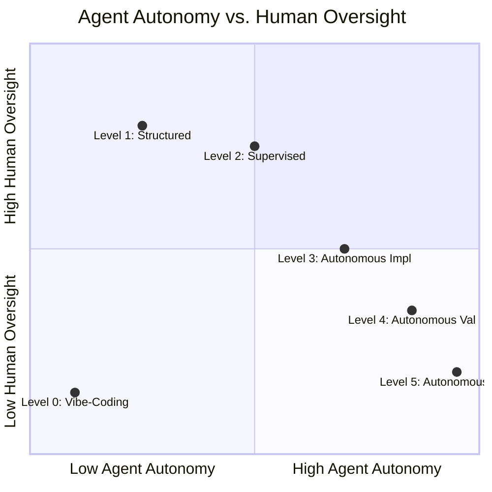

---

## Level 0 -- Vibe-Coding

> "Just talk to it and see what happens."

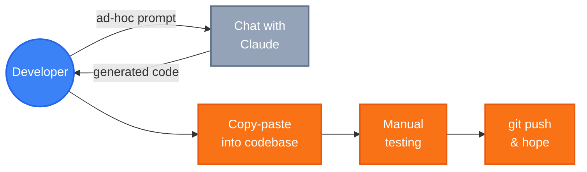

### Goal

Get comfortable using an AI coding assistant as a conversational partner. Build intuition for what it can and can't do.

### Workflow Characteristics

| Phase | How It Works |
|-------|-------------|
| **Planning** | Developer decides what to build. Maybe describes it in chat. No formal structure. |
| **Implementation** | Developer prompts the agent conversationally: "build me a login page." Accepts or rejects suggestions inline. Copy-pastes from chat into the codebase. |
| **Validation** | Manual testing. Developer runs the app and clicks around. Maybe some unit tests if the developer writes them. |
| **Deployment** | Manual. `git push` and hope. Or a basic CI pipeline that the developer set up by hand. |

### Example Release Loop

```
Developer: "Hey Claude, add a dark mode toggle to the settings page"
Claude:    [generates component code in chat]
Developer: [copies code into project, tweaks it, manually tests]
Developer: [commits, pushes, deploys manually]
```

### Constraints

- No structured prompts or templates -- it's conversational
- No automated testing driven by the agent
- No branch/PR discipline enforced by the agent
- The agent has no awareness of the broader codebase architecture

### What Works Well

- Low barrier to entry -- anyone can start today
- Good for exploration, prototyping, and learning
- Builds trust and intuition with AI-assisted development

### What Breaks Down

- Inconsistent quality -- depends entirely on prompt quality
- No repeatability -- same request, different results
- Context window limits mean the agent forgets what it did 5 minutes ago
- No guardrails -- the agent will happily generate insecure or architecturally wrong code

### Transition Criteria to Level 1

- [ ] Team has used an AI coding assistant for at least 2-4 weeks
- [ ] Developers can articulate what the agent is good and bad at
- [ ] There's a shared desire for more consistency and structure
- [ ] The codebase has basic CI (linting, compilation, at minimum)

---

## Level 1 -- Structured Prompting

> "Give it context and constraints, not just wishes."

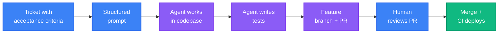

### What Changes from Level 0

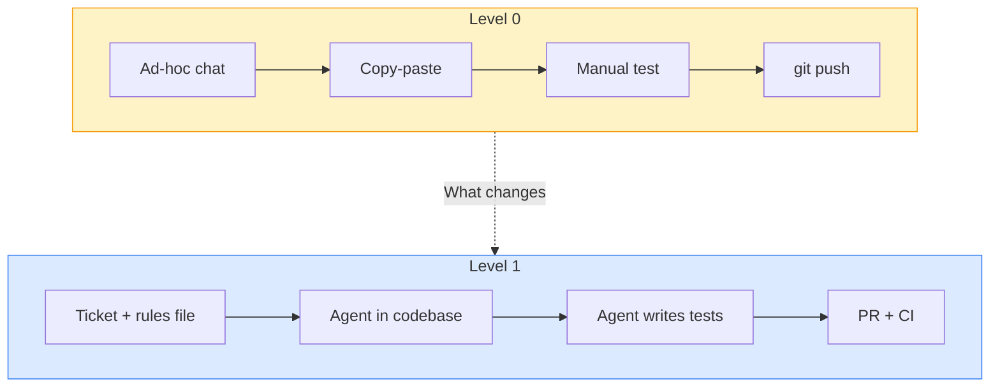

### Goal

Move from ad-hoc prompting to deliberate, structured interactions. The agent operates within defined boundaries and follows repeatable patterns.

### Workflow Characteristics

| Phase | How It Works |
|-------|-------------|
| **Planning** | Developer writes a clear task description with acceptance criteria before prompting. May use a ticket or template. |
| **Implementation** | Developer gives the agent scoped instructions: "implement this function following our existing patterns in `src/auth/`." Agent works in the actual codebase (not just chat). |
| **Validation** | Agent writes tests as part of implementation. Developer reviews the tests AND the code. CI runs automatically on push. |
| **Deployment** | Standard PR workflow. Agent creates branches and commits. Human merges after review. Deployment via existing CI/CD pipeline. |

### Example Release Loop

```
1. Developer writes ticket: "Add rate limiting to the /api/auth endpoint.
   AC: Returns 429 after 10 requests/minute. Includes Retry-After header."

2. Developer prompts agent: "Implement ticket #42. Follow the middleware
   pattern in src/middleware/. Write tests first."

3. Agent:
   - Creates branch feat/42-rate-limiting
   - Writes failing test for 429 response
   - Implements rate limiting middleware
   - Writes test for Retry-After header
   - Runs tests, confirms green
   - Commits and pushes

4. Developer: Reviews PR, requests change to error message format
5. Agent: Addresses the comment, pushes fix
6. Developer: Approves and merges
7. CI/CD deploys automatically
```

### Key Practices Introduced

- **AGENTS.md / rules files** -- a file in the repo root that tells the agent about project conventions, architecture, and constraints
- **Task scoping** -- one prompt = one well-defined unit of work
- **Test-first prompting** -- ask for tests before or alongside implementation
- **Branch discipline** -- agent creates feature branches, never commits to main
- **Codebase awareness** -- agent reads existing code to follow established patterns

### Constraints

- Human initiates every task -- the agent never acts unprompted
- Human reviews every line of output before merge
- No multi-step orchestration -- each prompt is a standalone interaction
- Agent doesn't create its own tickets or plan its own work

### Transition Criteria to Level 2

- [ ] AGENTS.md (or equivalent rules file) exists and is maintained
- [ ] Team consistently uses structured prompts with acceptance criteria
- [ ] Agent-generated PRs pass CI at least 80% of the time on first push
- [ ] Test coverage is improving (agent writes tests as standard practice)
- [ ] Developers trust the agent enough to review (not rewrite) its output
- [ ] Codebase has meaningful CI: tests, linting, formatting, type checks

---

## Level 2 -- Supervised Workflows

> "Chain the steps together. The agent runs the workflow; humans approve at gates."

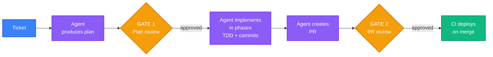

### Goal

The agent executes multi-step workflows autonomously, but stops at defined checkpoints for human approval. Think of it as a junior developer who follows a runbook and asks before proceeding at key decision points.

### Workflow Characteristics

| Phase | How It Works |
|-------|-------------|
| **Planning** | Agent receives a ticket and produces a structured plan (architecture doc, file list, test strategy). Human reviews the plan before implementation starts. |
| **Implementation** | Agent follows the approved plan step-by-step. Commits after each phase. Uses TDD: writes failing tests, implements, refactors. |
| **Validation** | Agent runs the full test suite and reports results. BDD/integration tests verify user-facing behaviour. Agent flags failures and proposes fixes. |
| **Deployment** | Agent creates a PR with full context. Human reviews. CI must pass. Human triggers deployment (or auto-deploy on merge to main). |

### Example Release Loop

```
1. Agent picks up ticket #87: "Add webhook retry logic with exponential backoff"

2. GATE 1 -- Plan Review
   Agent produces an architectural plan:
   - Phase 1: Add retry schema (migration + domain entity)
   - Phase 2: Implement retry logic with backoff calculation
   - Phase 3: Add dead-letter handling after max retries
   - Phase 4: Wire into existing webhook dispatcher
   Human reviews plan, approves with minor adjustments.

3. Agent executes:
   Phase 1: Creates migration, schema, entity. Commits.
   Phase 2: Writes tests for backoff formula. Implements. Commits.
   Phase 3: Writes tests for dead-letter. Implements. Commits.
   Phase 4: Integration tests. Wires in. Commits.

4. GATE 2 -- PR Review
   Agent pushes branch, creates PR with:
   - Summary of all changes
   - Link to ticket
   - Test results
   Human reviews, approves.

5. CI passes. Merge triggers deployment.
```

### Key Practices Introduced

- **Skill/workflow orchestration** -- named, repeatable workflows (e.g., "pick up ticket", "create feature", "fix bug") that the agent follows
- **Approval gates** -- defined moments where the agent pauses for human input
- **Phased implementation** -- agent breaks work into phases and commits incrementally
- **BDD feature files** -- agent generates behaviour specs that humans review before implementation
- **Automated PR review** -- a second agent persona reviews the first agent's code (pair review)
- **App/module ownership rules** -- the agent consults a registry to know which module owns which domain concept

### Constraints

- Agent pauses at every gate -- never auto-merges or auto-deploys
- Human still writes tickets (agent doesn't create its own work)
- Agent stays within the approved plan -- no improvisation
- Rollback is manual

### Risks and Guardrails

| Risk | Guardrail |
|------|-----------|
| Agent executes a bad plan | Plan review gate catches it before implementation |
| Agent introduces cross-module coupling | Ownership registry + compile-time boundary enforcement |
| Agent generates insecure code | Security-focused BDD tests (OWASP ZAP scans) run in CI |
| Agent commits secrets | Pre-commit hooks scan for secrets; CI blocks |
| Scope creep | Plan defines scope; agent creates follow-up tickets for out-of-scope items |

### Transition Criteria to Level 3

- [ ] At least 3 named workflows exist and are used consistently (e.g., create feature, fix bug, research spike)
- [ ] Agent-generated plans are approved without major rework >70% of the time
- [ ] CI pipeline includes: unit tests, integration tests, linting, formatting, security scans
- [ ] BDD feature files are standard practice for user-facing changes
- [ ] Code ownership / architectural boundaries are documented and enforced
- [ ] Team has a "second agent reviewer" or equivalent automated review step
- [ ] Agent-generated PRs are merged without significant rework >80% of the time

---

## Level 3 -- Autonomous Implementation

> "Give it the problem. It figures out the solution."

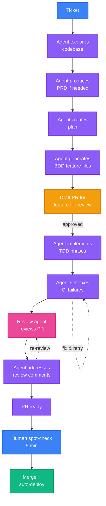

### Goal

The agent owns the entire implementation lifecycle -- from ticket to PR. Humans shift from directing the work to reviewing the outcomes. The agent plans its own approach, writes its own tests, and resolves its own review comments.

### Workflow Characteristics

| Phase | How It Works |
|-------|-------------|
| **Planning** | Agent reads the ticket, explores the codebase, and produces a plan. For complex features, it may interview the human for requirements (PRD). No mandatory plan approval gate for standard tickets. |
| **Implementation** | Agent creates the branch, implements with TDD, commits incrementally, pushes. Handles its own error recovery (test failures, lint issues, type errors). |
| **Validation** | Agent runs all test suites, addresses CI failures, requests automated review from a second agent, and resolves review comments. Agent self-validates against the ticket's acceptance criteria. |
| **Deployment** | Agent creates PR with `Closes #N`. Human does a lightweight review (spot-check, not line-by-line). Merge triggers deployment. |

### Example Release Loop

```
1. Human creates ticket: "Users should receive email notifications
   when someone comments on their document"

2. Agent autonomously:
   - Reads ticket, explores notification system and document code
   - Produces a PRD (if the ticket is underspecified, asks the human)
   - Creates architectural plan
   - Generates BDD feature files
   - Creates draft PR with feature files for quick human review
   - Human approves feature files (lightweight check)
   - Implements in TDD phases:
     * Domain event: DocumentCommentAdded
     * Event subscriber in notifications app
     * Email template and delivery
     * Integration tests
   - Runs full suite, fixes any failures
   - Marks PR ready for review
   - Second agent reviews, leaves comments
   - Agent addresses review comments
   - CI passes

3. Human: Spot-checks PR (5 minutes, not 30). Approves.
4. Merge. Auto-deploy.
```

### Key Practices Introduced

- **Agent-driven planning** -- agent produces plans without being told how to structure them
- **Self-healing CI** -- agent detects and fixes its own CI failures (up to N retries)
- **Review loop** -- agent submits PR, review-agent reviews, implementation-agent fixes, repeat until clean
- **Acceptance reconciliation** -- agent checks off acceptance criteria from the ticket and reports coverage
- **Follow-up ticket creation** -- agent creates tickets for deferred scope instead of scope-creeping
- **Lightweight human review** -- humans review for intent correctness, not implementation details

### Constraints

- Human still creates tickets (defines *what*, not *how*)
- Human still approves PRs before merge (even if briefly)
- Agent does not deploy without human merge action
- Agent does not modify CI/CD infrastructure
- Agent does not make architectural decisions that weren't in the plan (creates a ticket instead)

### Risks and Guardrails

| Risk | Guardrail |
|------|-----------|
| Agent misunderstands the ticket | PRD interview step catches ambiguity; draft PR with feature files lets human verify intent early |
| Agent produces working but architecturally poor code | Automated review agent checks patterns; compile-time boundary enforcement catches violations |
| Agent enters an infinite fix loop | Retry limits on CI fix attempts; escalates to human after N failures |
| Agent scope-creeps | Follow-up ticket creation policy; plan defines boundaries |
| Subtle bugs pass spot-check review | BDD tests encode expected behaviour; security scans catch vulnerabilities |

### Transition Criteria to Level 4

- [ ] Agent successfully delivers tickets end-to-end (ticket to merged PR) >80% of the time
- [ ] Human review time per PR is under 10 minutes on average
- [ ] Agent creates follow-up tickets when appropriate (not scope-creeping)
- [ ] CI pipeline is comprehensive: unit, integration, BDD, security, and architectural boundary checks
- [ ] Agent self-resolves CI failures >90% of the time
- [ ] Team has metrics on agent success rate, review time, and defect rate
- [ ] No production incidents directly caused by agent-generated code in the last 4 weeks

---

## Level 4 -- Autonomous Validation

> "The agent proves its own work is correct. Humans verify the verification."

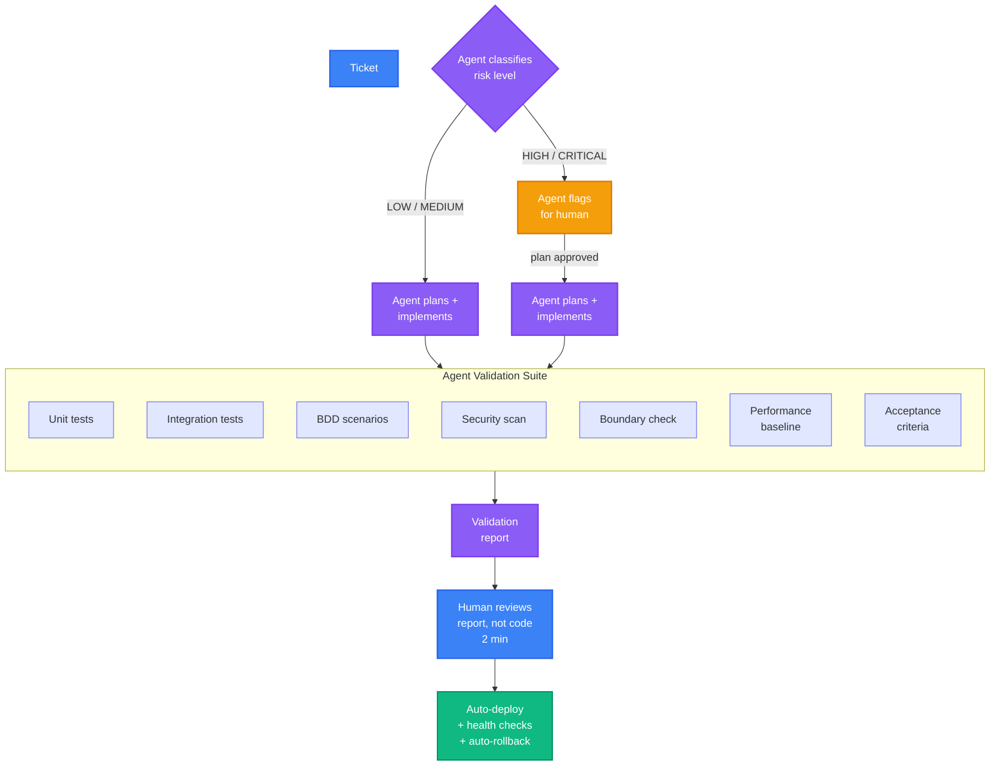

### Goal

The agent doesn't just implement -- it validates its own work against multiple quality dimensions (correctness, security, performance, architecture) and provides evidence. Humans shift from reviewing code to reviewing the agent's validation reports.

### Workflow Characteristics

| Phase | How It Works |
|-------|-------------|
| **Planning** | Agent picks up tickets, plans, and begins. For high-risk changes, it flags for human input before starting. It classifies ticket risk level automatically. |
| **Implementation** | Same as Level 3, but with richer self-checks: the agent verifies its changes against architectural rules, performance baselines, and security policies. |
| **Validation** | Agent produces a validation report: test results, coverage delta, security scan results, boundary check results, acceptance criteria reconciliation. Human reviews the *report*, not the code. |
| **Deployment** | Agent creates PR with validation report attached. Human approves based on the report. Auto-deploy on merge. Rollback is automated if health checks fail post-deploy. |

### Example Release Loop

```
1. Human creates ticket: "Migrate user sessions from cookie-based
   to database-backed storage"

2. Agent classifies: HIGH RISK (auth system, data migration)
   Agent flags: "This touches the auth boundary. I'll produce a
   detailed plan for review before proceeding."

3. Human reviews plan. Approves.

4. Agent implements across 6 phases with incremental commits.

5. Agent produces validation report:
   +-----------------------------------------+--------+
   | Check                                   | Status |
   +-----------------------------------------+--------+
   | Unit tests (47 new, 12 modified)        | PASS   |
   | Integration tests (8 new)               | PASS   |
   | BDD scenarios (3 new browser tests)     | PASS   |
   | Security scan (OWASP ZAP)               | PASS   |
   | Boundary check (no cross-app coupling)  | PASS   |
   | Migration rollback tested               | PASS   |
   | Performance: session lookup < 5ms p99   | PASS   |
   | Acceptance criteria: 4/4 checked off    | PASS   |
   +-----------------------------------------+--------+

6. Human reviews the report (2 minutes). Approves PR.
7. Merge. Auto-deploy. Health checks pass.
```

### Key Practices Introduced

- **Risk classification** -- agent categorises tickets by blast radius and flags high-risk items
- **Validation reports** -- structured evidence that the change is correct, secure, and performant
- **Automated rollback** -- deployment includes health checks; failed checks trigger automatic rollback
- **Observability integration** -- agent checks dashboards/logs post-deploy to confirm no regressions
- **Regression baselines** -- agent captures before/after metrics for test coverage, performance, error rates
- **Documentation auto-update** -- agent updates API docs, README, and architecture docs as part of the change

### Constraints

- Human still approves PRs (reviewing the report, not every line)
- High-risk changes still require plan approval
- Agent does not change deployment infrastructure or CI pipeline configuration
- Agent does not make unilateral decisions about data migrations without human sign-off

### Risks and Guardrails

| Risk | Guardrail |
|------|-----------|
| Agent's validation is incomplete or misleading | Periodic human audits of validation reports; report format is standardised and verifiable |
| Agent under-classifies risk | Risk classification rules are explicit and auditable; humans can override |
| Automated rollback doesn't trigger | Health check coverage is reviewed quarterly; manual rollback procedure documented |
| Agent "marks all criteria as passed" without substance | Acceptance criteria reconciliation includes evidence links (test names, line numbers) |

### Transition Criteria to Level 5

- [ ] Validation reports are trusted: humans approve >90% of PRs based solely on the report
- [ ] Automated rollback has been triggered and worked correctly at least once
- [ ] Agent risk classification matches human assessment >90% of the time
- [ ] Post-deploy monitoring catches regressions automatically
- [ ] Zero production incidents from agent-generated code in the last 8 weeks
- [ ] Team is comfortable with the idea of the agent merging low-risk PRs autonomously
- [ ] Deployment frequency has increased measurably since Level 3
- [ ] Observability tooling (logging, monitoring, tracing) is in place and agent-accessible

---

## Level 5 -- Autonomous Release

> "The agent ships. Humans govern."

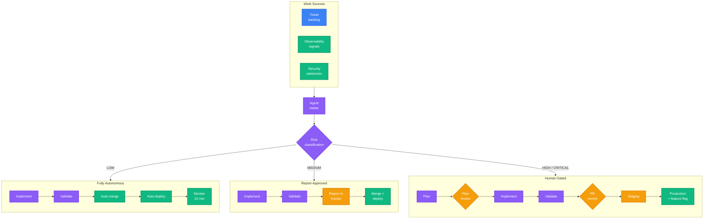

### Goal

The agent operates the full release cycle autonomously for approved classes of work. Humans define policy, set boundaries, and monitor outcomes -- but they don't drive individual changes. The agent is a trusted, independent contributor with merge and deploy authority for low-to-medium risk work.

### Workflow Characteristics

| Phase | How It Works |
|-------|-------------|
| **Planning** | Agent can pick up tickets from the backlog, or even propose work based on observability signals (e.g., "error rate on `/api/docs` increased 3x -- investigating"). Human-created tickets are standard, but the agent can suggest its own. |
| **Implementation** | Fully autonomous. Agent plans, implements with TDD, commits, and pushes. |
| **Validation** | Agent validates with the full Level 4 suite. For low-risk changes, the validation report IS the approval. For high-risk, human approval is still required. |
| **Deployment** | Low-risk: agent merges and deploys automatically after validation passes. Medium-risk: agent merges after human approves the report. High-risk: human approves plan + report + PR. |

### Example Release Loop (Low Risk -- Fully Autonomous)

```
1. Agent observes: dependency security advisory for a transitive dep
2. Agent creates ticket: "chore: update phoenix_live_view to patch CVE-2025-XXXX"
3. Agent:
   - Creates branch
   - Updates dependency
   - Runs full test suite
   - Runs security scan (confirms CVE resolved)
   - Generates validation report
   - Creates PR
   - Low-risk classification confirmed by rules engine
   - Auto-merges after CI passes
   - Auto-deploys
   - Monitors health checks for 15 minutes
   - Closes ticket
4. Human is notified: "Deployed patch for CVE-2025-XXXX. All checks green."
```

### Example Release Loop (High Risk -- Human Gated)

```
1. Human creates ticket: "Restructure the permissions model from
   role-based to attribute-based access control"

2. Agent classifies: CRITICAL RISK
   - Creates detailed PRD, interviews human for edge cases
   - Produces phased architectural plan
   - GATE: Human reviews and approves plan

3. Agent implements across 12 phases over multiple sessions
   - Each phase: TDD, commit, push, intermediate validation

4. Agent produces comprehensive validation report
   - GATE: Human reviews report and PR

5. Agent deploys to staging
   - GATE: Human verifies staging behaviour

6. Agent deploys to production with feature flag (off)
   - GATE: Human enables feature flag after smoke test

7. Agent monitors for 24 hours, reports metrics
8. Human confirms rollout complete
```

### Risk-Based Approval Matrix

| Risk Level | Examples | Plan Approval | PR Approval | Deploy Approval |
|-----------|----------|--------------|-------------|-----------------|
| **Low** | Dep updates, typo fixes, config tweaks, doc updates | None | Auto (validation report) | Auto |
| **Medium** | Bug fixes, small features, refactors | None | Human reviews report | Auto on merge |
| **High** | New features, API changes, schema migrations | Human approves plan | Human reviews PR | Human triggers |
| **Critical** | Auth changes, data model changes, infrastructure | Human approves plan + feature files | Human reviews PR line-by-line | Human triggers with staging gate |

### Key Practices Introduced

- **Policy-based autonomy** -- explicit rules define what the agent can do without asking
- **Agent-initiated work** -- agent proposes tickets based on signals (security advisories, error spikes, performance degradation)
- **Auto-merge for low-risk** -- validation report serves as the approval; no human in the loop
- **Continuous monitoring** -- agent watches post-deploy metrics and auto-rolls back if thresholds are breached
- **Audit trail** -- every autonomous action is logged with reasoning, validation evidence, and outcome
- **Escalation protocol** -- agent knows when to stop and ask a human

### Target-State Architecture

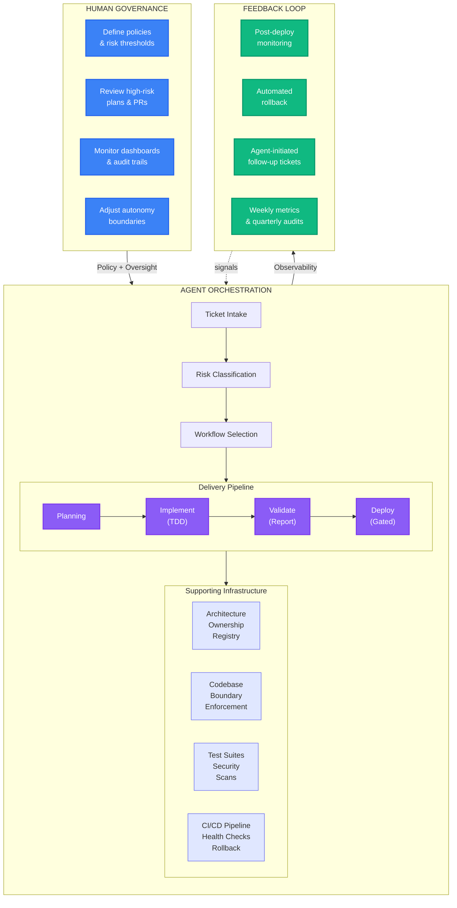

### How Human Oversight Changes Across Levels

| Aspect | Level 0-1 | Level 2-3 | Level 4-5 |
|--------|----------|----------|----------|
| **What humans write** | Code | Tickets + acceptance criteria | Policies + risk thresholds |
| **What humans review** | Every line of code | Plans and PRs | Validation reports and dashboards |
| **Time per change** | Hours (writing) | 10-30 min (reviewing) | 2-5 min (spot-checking) or 0 (auto) |
| **Deployment trigger** | Manual | Human merges | Auto (low-risk) or human (high-risk) |
| **Error recovery** | Human debugs | Agent fixes, human verifies | Agent fixes, monitors, escalates if needed |
| **Architecture decisions** | Human decides | Human approves agent's plan | Agent follows policy, escalates novel decisions |

### Risks and Guardrails

| Risk | Guardrail |
|------|-----------|
| Agent auto-deploys a breaking change | Health check monitoring + automated rollback + post-deploy metric comparison |
| Agent creates unnecessary work (ticket spam) | Agent-initiated tickets require minimum evidence threshold; weekly triage review |
| Humans lose understanding of the codebase | Mandatory human review of high/critical risk changes; rotating "deep review" duty |
| Agent makes a chain of bad decisions | Circuit breaker: N consecutive failures disable auto-merge, escalate to human |
| Security vulnerability in autonomous pipeline | Agent tokens are scoped and short-lived; audit trail for every action; secrets never in code |
| Regulatory/compliance concerns | Audit trail meets SOC2/ISO requirements; human approval required for compliance-sensitive changes |

---

## Summary: The Progression

```
Level 0: Human writes code.      Agent suggests.
Level 1: Human directs.          Agent executes tasks.
Level 2: Human approves.         Agent runs workflows.
Level 3: Human spot-checks.      Agent delivers features.
Level 4: Human reviews evidence. Agent proves correctness.
Level 5: Human governs.          Agent ships autonomously.
```

### Where Developer Time Goes

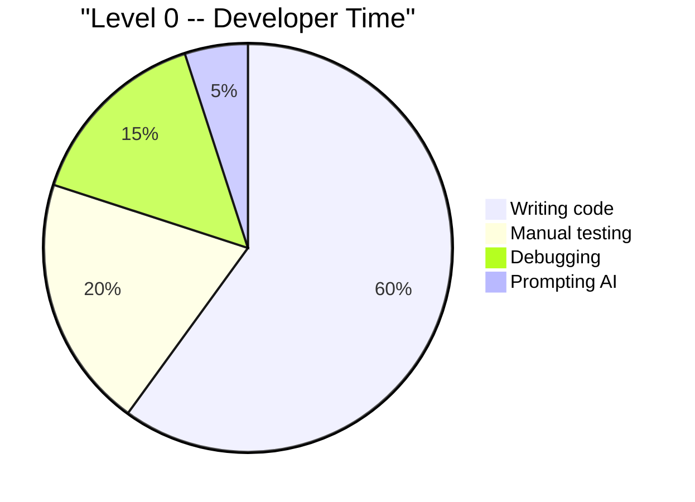

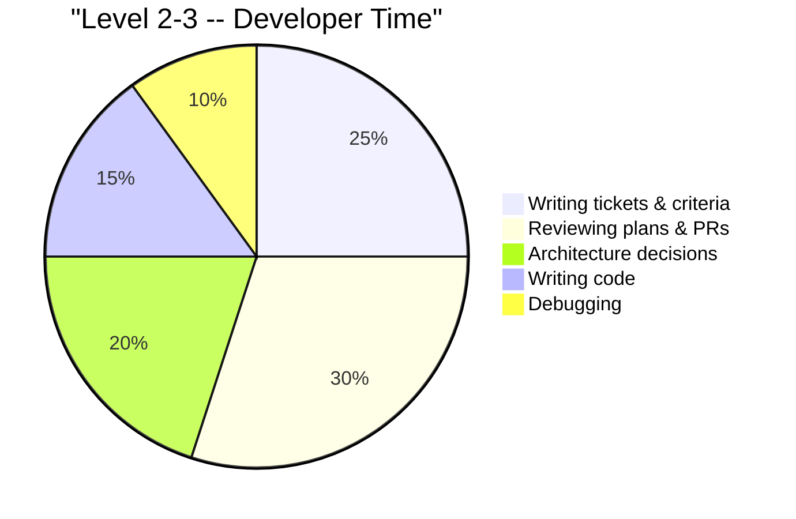

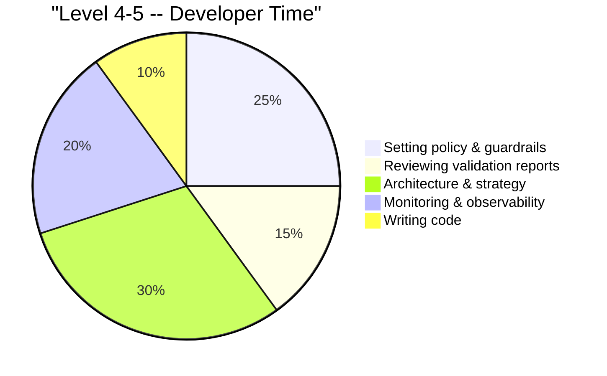

### The Human Role Journey

```mermaid
journey
    title How the Human Role Evolves
    section Level 0-1: Craftsperson
        Write code manually: 2: Developer
        Prompt AI for suggestions: 3: Developer
        Review AI output line-by-line: 3: Developer
    section Level 2-3: Technical Lead
        Write tickets with AC: 4: Developer
        Review plans and PRs: 4: Developer
        Define ownership rules: 5: Developer
    section Level 4-5: Governor
        Set risk policies: 5: Developer
        Review validation reports: 5: Developer
        Monitor dashboards: 4: Developer
        Audit autonomous actions: 4: Developer
```

### What Changes at Each Transition

| Transition | What You Gain | What You Must Have First |
|-----------|--------------|------------------------|
| **0 -> 1** | Consistency, test generation, branch discipline | AI familiarity, basic CI |
| **1 -> 2** | Multi-step automation, approval gates, BDD | Rules file, structured prompts, reliable CI |
| **2 -> 3** | Agent-driven delivery, self-healing CI | Named workflows, ownership rules, review automation |
| **3 -> 4** | Validation reports, risk classification, auto-rollback | Comprehensive CI, observability, proven agent track record |
| **4 -> 5** | Autonomous releases, agent-initiated work | Trusted validation, automated rollback, policy framework |

### Guardrails Stack by Level

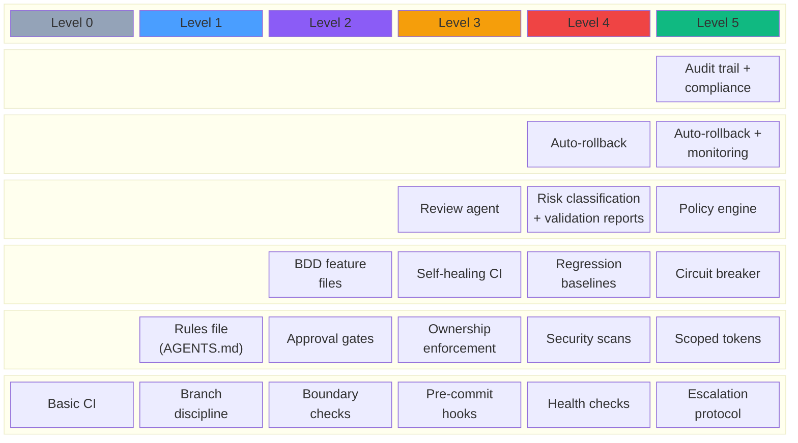

### The One Rule That Never Changes

> **Autonomy is earned, not assumed.** Each level of agent independence is gated by demonstrated reliability at the previous level. Move up when the data says you're ready, not when it feels like you should be.

---

## Appendix: Getting Started (Level 0 -> Level 1)

If you're at Level 0 today, here's how to take the first step:

1. **Create a rules file** -- add an `AGENTS.md` (or `.cursorrules`, or `claude.md`) to your repo root. Document your project structure, naming conventions, and test expectations. This is the single highest-leverage thing you can do.

2. **Write tickets with acceptance criteria** -- before prompting the agent, write down what "done" looks like. Even a bullet list works.

3. **Ask for tests first** -- every prompt should include "write tests first" or "use TDD." This one habit catches most agent mistakes.

4. **Use branches** -- tell the agent to create a feature branch. Never let it commit to main.

5. **Review, don't rewrite** -- resist the urge to rewrite agent output. Review it like you'd review a colleague's PR. If it's wrong, tell the agent what to fix and let it try again.

6. **Iterate** -- the first week will feel slower than coding yourself. By week three, you'll be faster. By week six, you won't go back.
