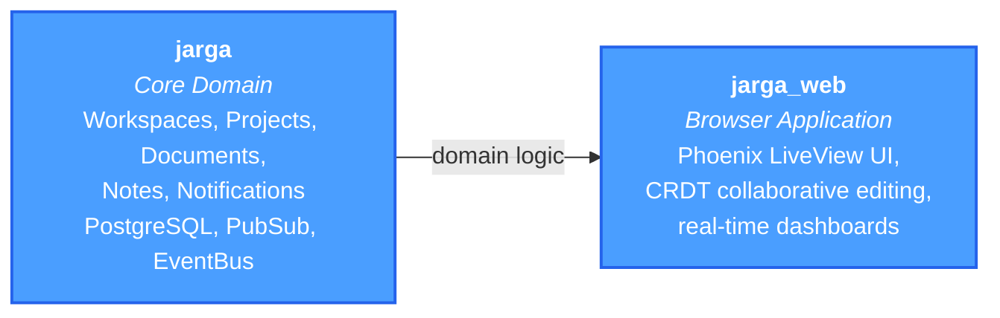
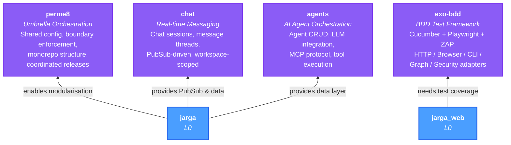
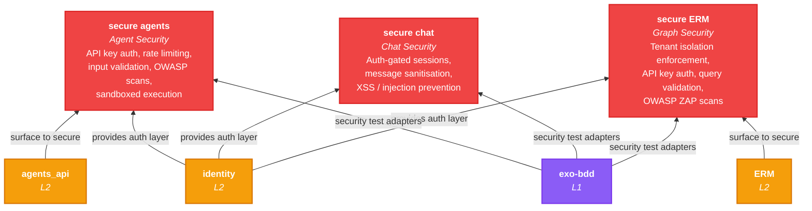
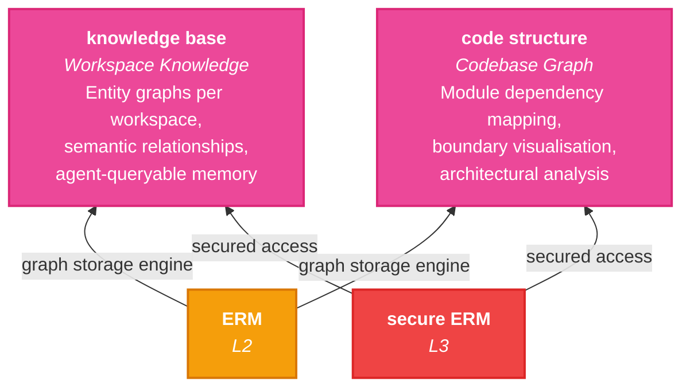
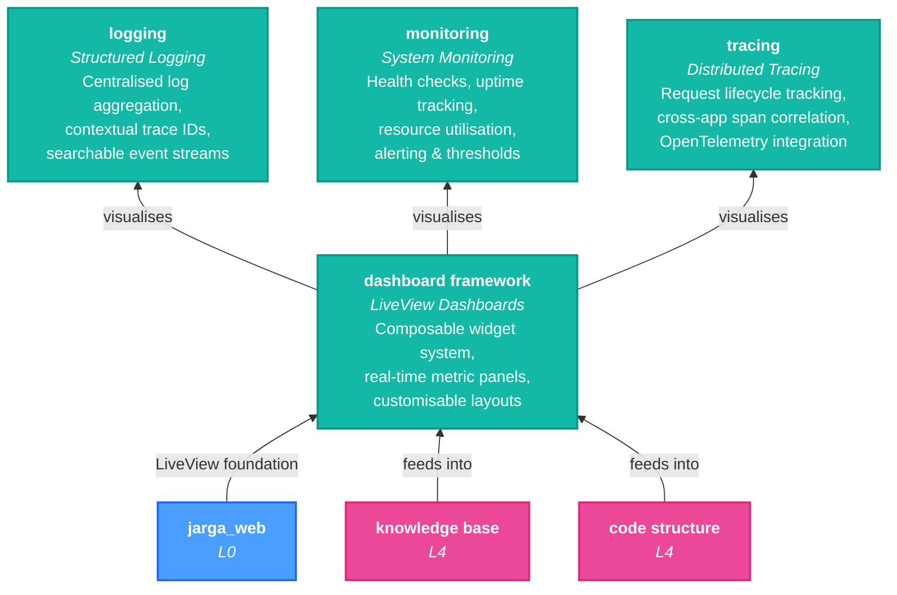
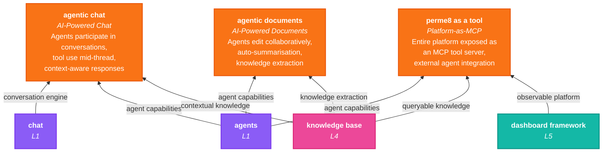
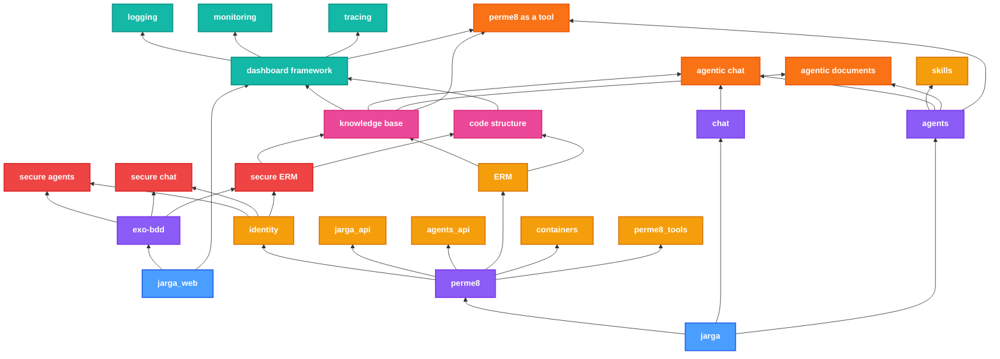

# Perme8 Tech Tree

A capability progression showing how each piece of the platform unlocks the next
tier. Build from the bottom up -- completing a level gates access to the next.

Items in **bold** are gate prerequisites annotated with which level they unlock.

---

## Level 0 -- Foundation

> A working collaborative editing app. The seed of everything.

| App | What It Provides | Gate? |
|-----|-----------------|-------|
| **jarga** | Core domain logic: workspaces, projects, documents, notes, notifications. Owns PostgreSQL, PubSub, EventBus, Mailer. | Both required to unlock Level 1 |
| **jarga_web** | Phoenix LiveView browser UI with CRDT collaborative document editing and real-time dashboards. | Both required to unlock Level 1 |

---

## Level 1 -- Framework

> Modularise. Add testing infrastructure, chat, and AI capabilities.

| App | What It Provides | Gate? |
|-----|-----------------|-------|
| **perme8** | Umbrella shell: shared config, compile-time boundary enforcement, dependency management, coordinated releases. | Required to unlock Level 2 |
| **exo-bdd** | BDD test framework: Cucumber.js + Playwright + OWASP ZAP with HTTP, Browser, CLI, Graph, and Security adapters. | Required to unlock Level 3 |
| **chat** | Real-time messaging: chat sessions, message threads, PubSub-driven, workspace-scoped. | -- |
| **agents** | AI agent orchestration: agent definitions, LLM integration (OpenRouter), MCP protocol tools, tool execution engine. | -- |

---

## Level 2 -- Modularisation

> Extract bounded contexts into isolated apps. Add APIs, graph storage, containers.

```mermaid
graph BT
    %% Level 0 (prerequisites)
    JARGA["<b>jarga</b><br/><i>L0</i>"]:::l0

    %% Level 1 (prerequisites)
    PERME8["<b>perme8</b><br/><i>L1</i>"]:::l1
    AGENTS["<b>agents</b><br/><i>L1</i>"]:::l1

    %% Level 2 (unlocked)
    IDENTITY["<b>identity</b><br/><i>Authentication &amp; RBAC</i><br/>Registration, login, sessions,<br/>multi-tenancy, API keys,<br/>membership &amp; roles"]:::l2
    JARGA_API["<b>jarga_api</b><br/><i>REST API (Documents)</i><br/>JSON API for workspaces,<br/>projects &amp; documents,<br/>API-key authenticated"]:::l2
    AGENTS_API["<b>agents_api</b><br/><i>REST API (Agents)</i><br/>Agent CRUD, query execution,<br/>MCP skills, OpenAPI 3.0 spec"]:::l2
    ERM["<b>entity_relationship_manager</b><br/><i>Knowledge Graph</i><br/>Schema-driven entities &amp; edges,<br/>Neo4j traversal,<br/>tenant-isolated graph API"]:::l2
    CONTAINERS["<b>containers</b><br/><i>Ephemeral Runtimes</i><br/>Docker coding sessions,<br/>sandboxed agent execution,<br/>opencode integration"]:::l2
    SKILLS["<b>skills</b><br/><i>Agent Skills</i><br/>Reusable skill definitions,<br/>tool composition,<br/>prompt orchestration"]:::l2
    TOOLS["<b>perme8_tools</b><br/><i>Dev Tooling</i><br/>BDD step linter, behaviour checker,<br/>boundary scaffolding,<br/>exo-bdd runner, CI sync"]:::l2

    PERME8 -->|"unlocks bounded contexts"| IDENTITY
    PERME8 -->|"unlocks bounded contexts"| JARGA_API
    PERME8 -->|"unlocks bounded contexts"| AGENTS_API
    PERME8 -->|"unlocks bounded contexts"| ERM
    PERME8 -->|"unlocks bounded contexts"| CONTAINERS
    AGENTS -->|"needs skill system"| SKILLS
    PERME8 -->|"enables dev tooling"| TOOLS
    JARGA -->|"domain logic"| JARGA_API

    classDef l0 fill:#4a9eff,stroke:#2563eb,color:#fff,stroke-width:2px
    classDef l1 fill:#8b5cf6,stroke:#7c3aed,color:#fff,stroke-width:2px
    classDef l2 fill:#f59e0b,stroke:#d97706,color:#fff,stroke-width:2px
```

| App | What It Provides | Gate? |
|-----|-----------------|-------|
| **identity** | Extracted auth boundary: user registration, login (password + magic link), sessions, RBAC membership, workspace multi-tenancy, API key management. | Required to unlock Level 3 |
| **jarga_api** | JSON REST API for programmatic access to workspaces, projects, and documents. | -- |
| **agents_api** | JSON REST API for agent management: CRUD, query execution, MCP skill listing, OpenAPI 3.0 spec. | -- |
| **entity_relationship_manager** | Schema-driven knowledge graph backed by Neo4j. Tenant-isolated entities, edges, traversal, bulk operations. | -- |
| **containers** | Ephemeral Docker runtimes for sandboxed agent coding sessions (opencode integration). | -- |
| **skills** | Reusable agent skill definitions, tool composition, and prompt orchestration patterns. | -- |
| **perme8_tools** | Dev-time Mix tasks: BDD step linter, behaviour checker, boundary scaffolding, exo-bdd runner, CI sync. | -- |

---

## Level 3 -- Productionisation

> Lock it down. Security hardening across all external surfaces.

| Capability | What It Provides | Unlocked By |
|------------|-----------------|-------------|
| **secure agents** | Production-hardened agent API: API key authentication, rate limiting, input validation, OWASP security scans, sandboxed execution. | identity + exo-bdd |
| **secure chat** | Production-hardened chat: auth-gated sessions, message sanitisation, XSS and injection prevention. | identity + exo-bdd |
| **secure ERM** | Production-hardened knowledge graph: tenant isolation enforcement, API key auth, query validation, OWASP ZAP scans. | identity + exo-bdd |

---

## Level 4 -- Graphs

> Structured knowledge. Map what you know and what you build.

| Capability | What It Provides | Unlocked By |
|------------|-----------------|-------------|
| **knowledge base** | Workspace-scoped knowledge graphs: entity relationships, semantic connections, agent-queryable structured memory. | ERM + secure ERM |
| **code structure** | Codebase-as-a-graph: module dependency mapping, boundary visualisation, architectural analysis via Neo4j. | ERM + secure ERM |

---

## Level 5 -- Observability

> See what's happening. Measure everything.

| Capability | What It Provides | Unlocked By |
|------------|-----------------|-------------|
| **dashboard framework** | Composable LiveView widget system: real-time metric panels, customisable layouts, pluggable data sources. | jarga_web + knowledge base + code structure |
| **logging** | Structured, centralised log aggregation with contextual trace IDs and searchable event streams. | dashboard framework |
| **monitoring** | System health checks, uptime tracking, resource utilisation metrics, alerting and thresholds. | dashboard framework |
| **tracing** | Distributed request tracing: cross-app span correlation, request lifecycle tracking, OpenTelemetry integration. | dashboard framework |

---

## Level 6 -- Composition

> Agents that act. Documents that think. The platform as a tool.

| Capability | What It Provides | Unlocked By |
|------------|-----------------|-------------|
| **agentic chat** | AI agents participate in conversations: tool use mid-thread, context-aware responses, knowledge-backed answers. | chat + agents + knowledge base |
| **agentic documents** | AI agents as document collaborators: auto-summarisation, knowledge extraction, collaborative editing. | agents + knowledge base |
| **perme8 as a tool** | The entire platform exposed as an MCP tool server: external agents can query, create, and manage workspaces, projects, documents, knowledge, and agents programmatically. | agents + knowledge base + dashboard framework |

---

## Full Overview

## Tech Stack

| Layer | Technologies |
|-------|-------------|
| **Backend** | Elixir 1.17+, Phoenix 1.8, Phoenix LiveView 1.1, Ecto, Bandit |
| **Frontend** | TypeScript, Tailwind CSS 4, esbuild, Heroicons |
| **Databases** | PostgreSQL 16+ (primary), Neo4j 5+ (graph) |
| **AI/LLM** | OpenRouter API, Hermes MCP (JSON-RPC 2.0 / StreamableHTTP) |
| **Auth** | Bcrypt, session cookies, API keys (SHA256-hashed) |
| **Testing** | ExUnit, Mox, Cucumber/Gherkin, Playwright, OWASP ZAP |
| **Architecture** | Clean Architecture, `boundary` lib (compile-time enforcement) |
| **Infra** | Docker (PostgreSQL, ZAP, opencode sessions), GitHub Actions CI |
